<div align="center">

<a href="https://github.com/femboypuppy/Tessera">
  <picture>
    <source media="(prefers-color-scheme: dark)" srcset="assets/brand/wordmark-dark.svg">
    
  </picture>
</a>

### Your notes, your server. Notion's power, Obsidian's freedom.

An open-source, local-first knowledge app: blocks and databases, `[[wikilinks]]` and a graph,
real-time collaboration and sandboxed plugins. On your device, on your own server.

[](https://github.com/femboypuppy/Tessera/actions/workflows/ci.yml)
[](https://github.com/femboypuppy/Tessera/releases/latest)
[](LICENSE)
[](https://github.com/femboypuppy/Tessera/pkgs/container/tessera)

**[Docs](https://femboypuppy.github.io/Tessera/)** ·
**[Download](https://github.com/femboypuppy/Tessera/releases/latest)** ·
**[Self-host](https://femboypuppy.github.io/Tessera/self-hosting/)** ·
**[Plugins](https://femboypuppy.github.io/Tessera/plugins/)** ·
**[Roadmap](#roadmap)**

</div>

<!-- PLACEHOLDER: assets/demo.gif is a "coming soon" frame until the polish phase records the demo (agents/12-polish.md). -->
<p align="center">
  
</p>

- **It's yours.** Your device holds the real data. Tessera works fully offline, and a server is optional.
- **No lock-in.** Import Notion and Obsidian in one click. Export to plain markdown any time.
- **Built to be extended.** Plugins run in a sandbox with permissions you approve.

## Features

### Write in blocks

A fast block editor with a slash menu, markdown shortcuts, drag handles, tables, callouts, toggles,
code with syntax highlighting, images and embeds. Type `[[` to link a page, `#` to tag it.

<picture>
  <source media="(prefers-color-scheme: dark)" srcset="assets/screenshots/editor/rich-page-dark.png">
  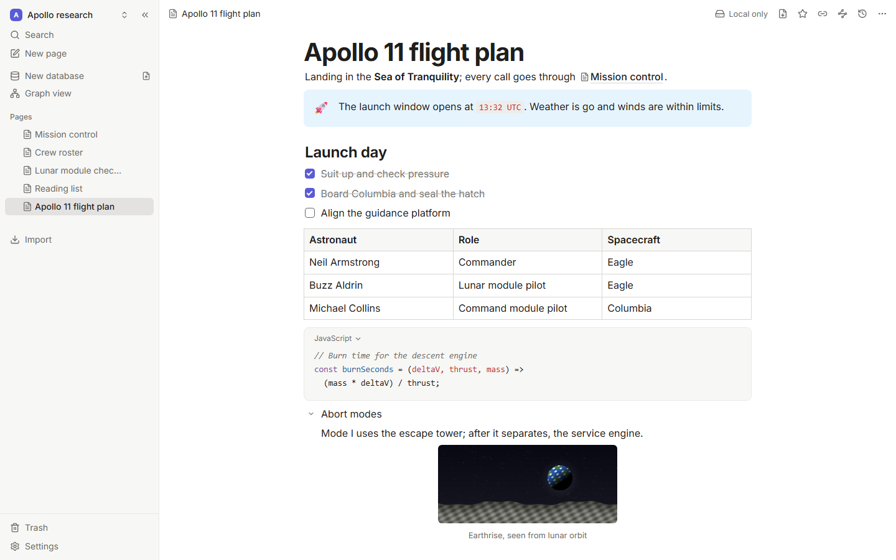
</picture>

<table>
  <tr>
    <td width="50%">
      <picture>
        <source media="(prefers-color-scheme: dark)" srcset="assets/screenshots/editor/slash-menu-dark.png">
        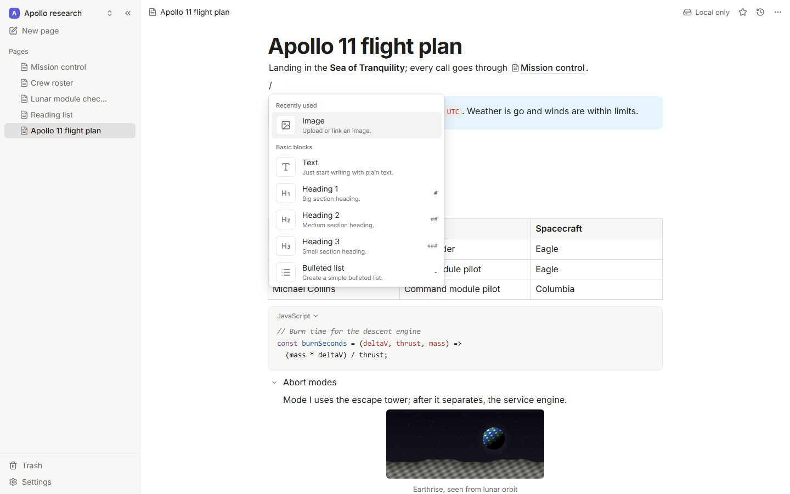
      </picture>
    </td>
    <td width="50%">
      <picture>
        <source media="(prefers-color-scheme: dark)" srcset="assets/screenshots/editor/link-preview-dark.png">
        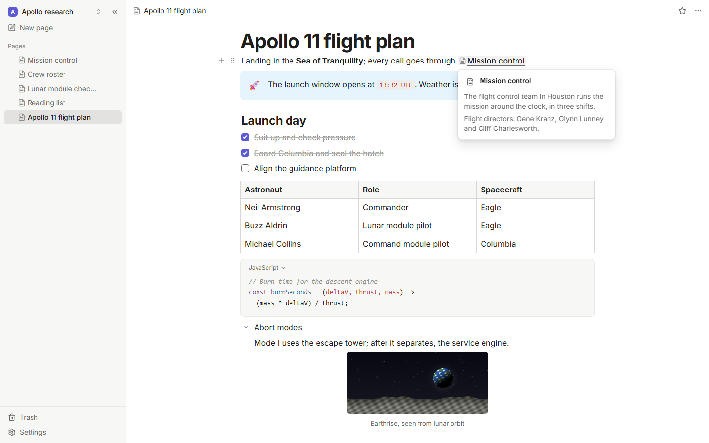
      </picture>
    </td>
  </tr>
</table>

### Databases with real views

Table, board, calendar, gallery and list views over typed properties: select, date, number,
relation, checkbox and more. Filter, sort and group, all offline, and smooth with 10,000 rows.

<picture>
  <source media="(prefers-color-scheme: dark)" srcset="assets/screenshots/databases/board-dark.png">
  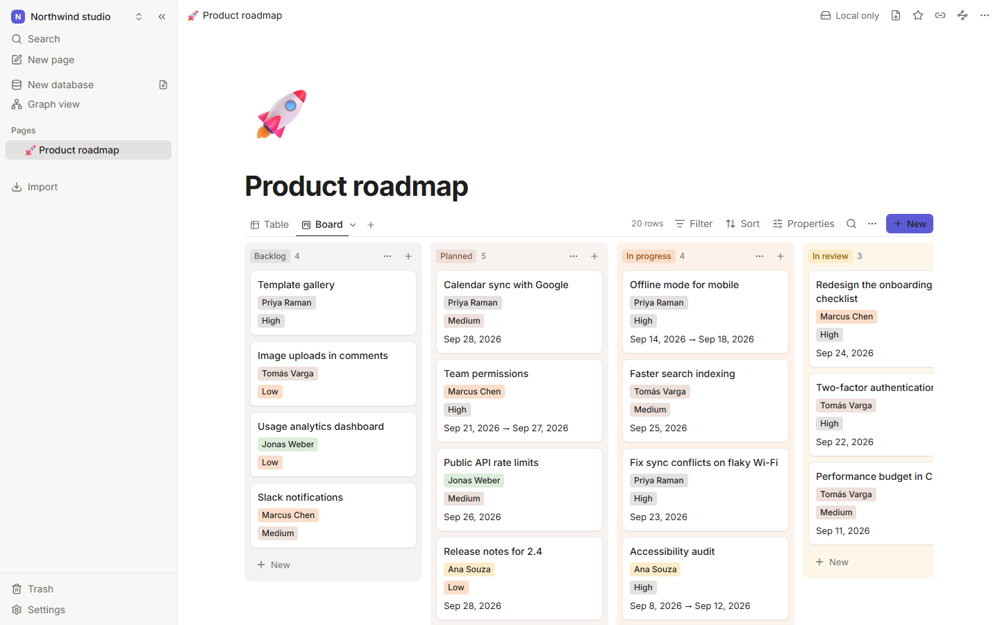
</picture>

<table>
  <tr>
    <td width="50%">
      <picture>
        <source media="(prefers-color-scheme: dark)" srcset="assets/screenshots/databases/table-dark.png">
        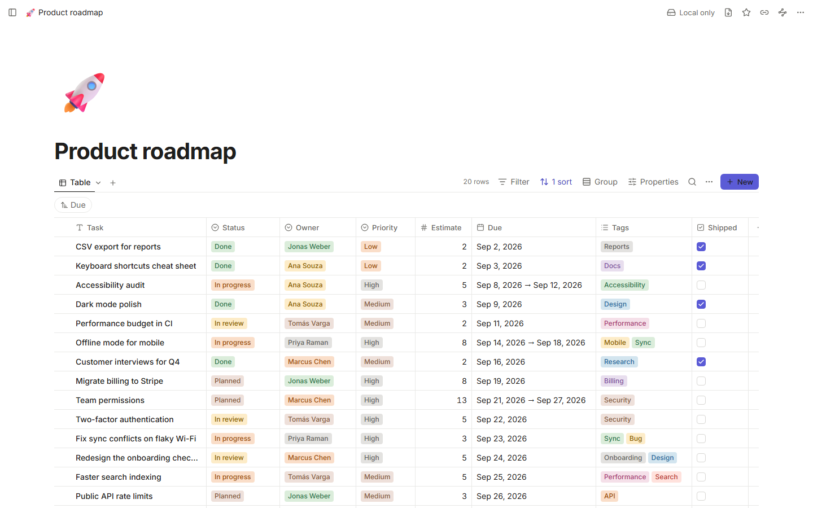
      </picture>
    </td>
    <td width="50%">
      <picture>
        <source media="(prefers-color-scheme: dark)" srcset="assets/screenshots/databases/calendar-dark.png">
        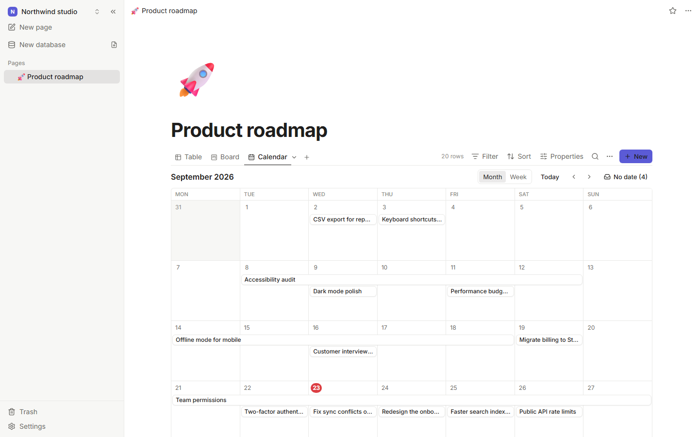
      </picture>
    </td>
  </tr>
</table>

### Links, backlinks and a graph

Every `[[link]]` works both ways. See what links here, turn unlinked mentions into links with one
click, and explore your notes as a graph.

<picture>
  <source media="(prefers-color-scheme: dark)" srcset="assets/screenshots/search/graph-dark.png">
  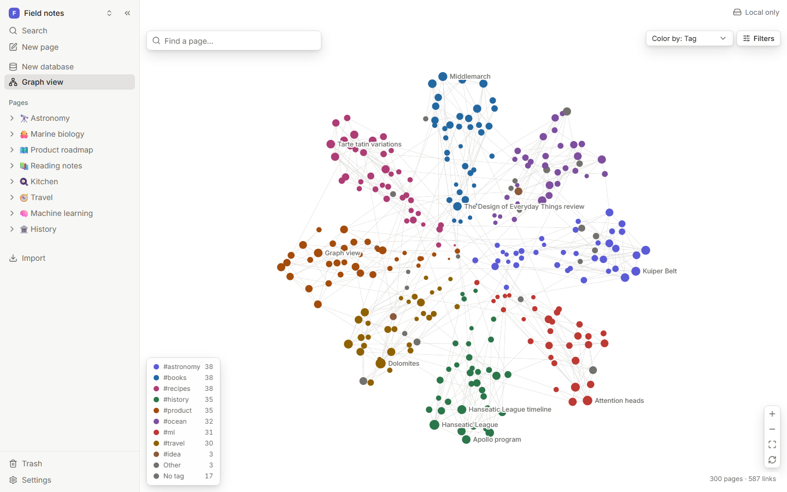
</picture>

<table>
  <tr>
    <td width="50%">
      <picture>
        <source media="(prefers-color-scheme: dark)" srcset="assets/screenshots/search/backlinks-dark.png">
        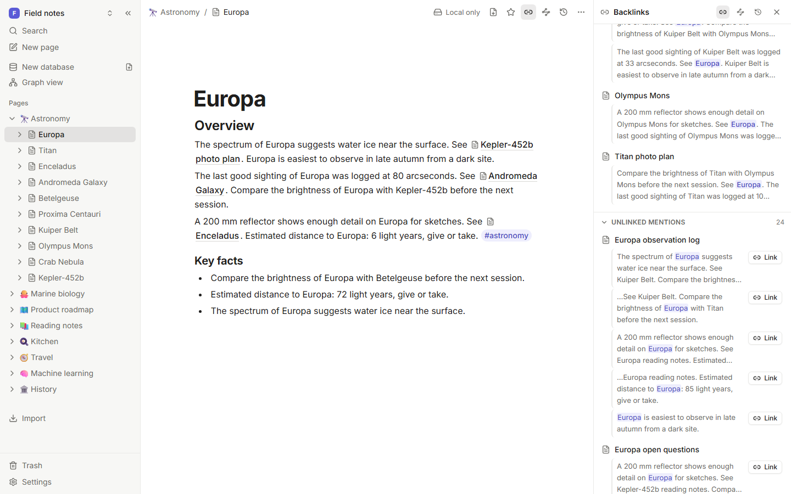
      </picture>
    </td>
    <td width="50%">
      <picture>
        <source media="(prefers-color-scheme: dark)" srcset="assets/screenshots/search/palette-dark.png">
        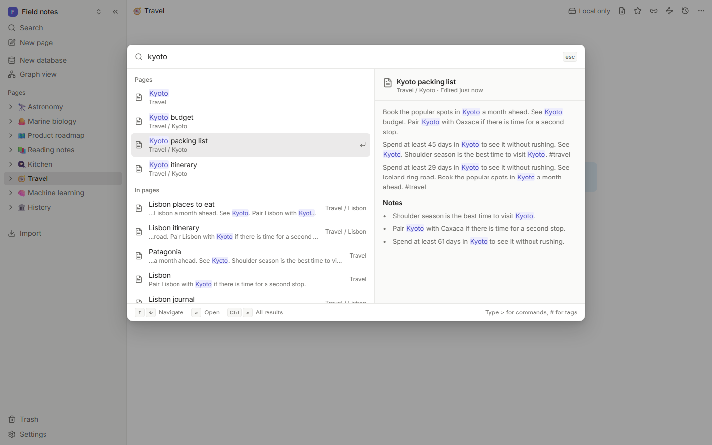
      </picture>
    </td>
  </tr>
</table>

### Find anything with <kbd>Ctrl</kbd>/<kbd>⌘</kbd> + <kbd>K</kbd>

One palette for pages, full-text results with highlights, tags and commands. Filters like
`tag:space`, `in:Projects` and `is:task` narrow it down.

### Collaborate in real time, or never go online

Edit the same page with others and see their cursors. Offline edits sync when you reconnect, with
nothing lost. Every page keeps a version history you can restore.

<table>
  <tr>
    <td width="50%">
      <picture>
        <source media="(prefers-color-scheme: dark)" srcset="assets/screenshots/sync/presence-dark.png">
        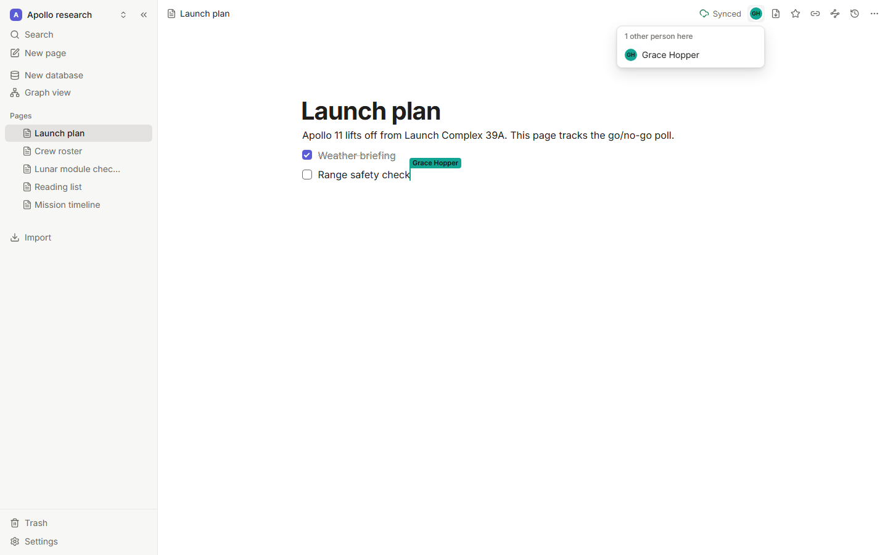
      </picture>
    </td>
    <td width="50%">
      <picture>
        <source media="(prefers-color-scheme: dark)" srcset="assets/screenshots/sync/history-panel-dark.png">
        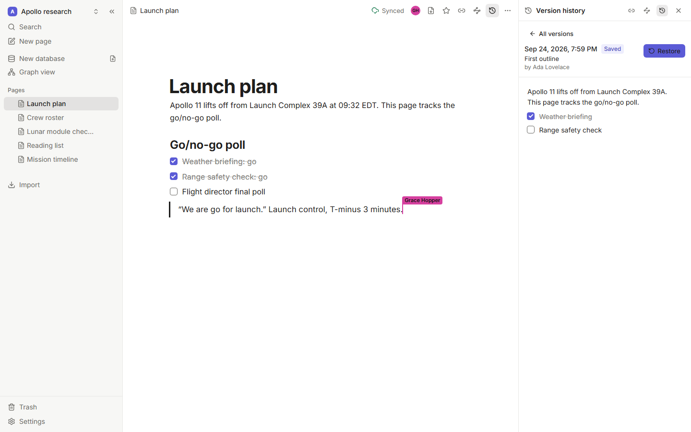
      </picture>
    </td>
  </tr>
</table>

### Plugins, safely sandboxed

Plugins add commands, panels and custom blocks. Each one runs in its own sandboxed iframe and can
only do what you allowed. Scaffold one with `pnpm create tessera-plugin`.

<table>
  <tr>
    <td width="50%">
      <picture>
        <source media="(prefers-color-scheme: dark)" srcset="assets/screenshots/plugins/mermaid-block-dark.png">
        
      </picture>
    </td>
    <td width="50%">
      <picture>
        <source media="(prefers-color-scheme: dark)" srcset="assets/screenshots/plugins/permission-prompt-dark.png">
        
      </picture>
    </td>
  </tr>
</table>

### Move in, move out

Import a Notion export, an Obsidian vault or a folder of markdown, with links, databases and
attachments intact. Export a page or everything to Obsidian-compatible markdown, HTML, PDF or a
full JSON backup.

<picture>
  <source media="(prefers-color-scheme: dark)" srcset="assets/screenshots/importers/import-report-dark.png">
  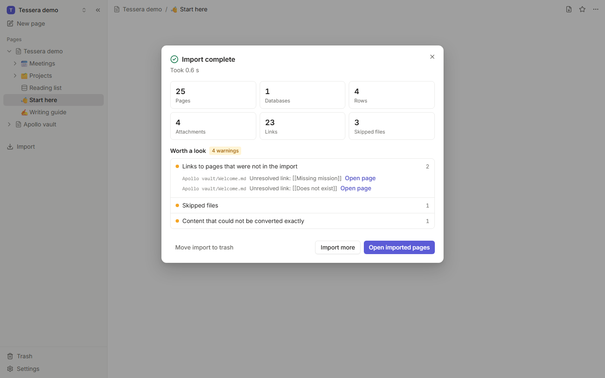
</picture>

### Desktop app and one-command self-hosting

Native apps for macOS, Windows and Linux keep each workspace in a folder you choose, with quick
capture from anywhere. The server is one container.

<picture>
  <source media="(prefers-color-scheme: dark)" srcset="assets/screenshots/desktop/desktop-window-dark.png">
  
</picture>

## Quickstart

**Desktop app.** Download it for macOS, Windows or Linux from the
[latest release](https://github.com/femboypuppy/Tessera/releases/latest) and open it. That's all.

**Docker, one line.**

```bash
docker run -d --name tessera -p 8787:8787 -v tessera-data:/data ghcr.io/femboypuppy/tessera:latest
```

Then open <http://localhost:8787> and create the owner account.

**Docker Compose** (with optional automatic HTTPS through Caddy):

```bash
mkdir tessera && cd tessera
curl -fsSLO https://raw.githubusercontent.com/femboypuppy/Tessera/main/docker-compose.yml
docker compose up -d
```

**From source** (Node 24 and pnpm 11):

```bash
git clone https://github.com/femboypuppy/Tessera.git && cd Tessera
corepack enable
pnpm install
pnpm dev
```

The [installation guide](https://femboypuppy.github.io/Tessera/guide/installation) covers every
option, and [self-hosting](https://femboypuppy.github.io/Tessera/self-hosting/) covers
configuration, HTTPS, backups and upgrades.

## How Tessera compares

Tessera is new (0.1). The products below are mature and polished; this table compares what each
one can do, not how refined it is. Last checked **2026-09-23** against each product's own docs,
pricing page and license.

|                                 | Tessera          | Notion                  | Obsidian             | Anytype                     | AFFiNE                                  | Logseq                     |
| ------------------------------- | ---------------- | ----------------------- | -------------------- | --------------------------- | --------------------------------------- | -------------------------- |
| Open source                     | ✅ MIT           | ❌                      | ❌                   | Source-available [^any-lic] | MIT client, source-available server [^affine-lic] | ✅ AGPL-3.0                |
| Local-first, works offline      | ✅               | ❌ [^notion-offline]    | ✅                   | ✅                          | ✅                                      | ✅                         |
| Self-hostable sync              | ✅ one container | ❌                      | ❌ [^obs-sync]       | ✅                          | ✅                                      | Experimental [^logseq-sync] |
| Real-time collaboration         | ✅               | ✅                      | ❌                   | Partial [^any-collab]       | ✅                                      | Beta [^logseq-db]          |
| Databases (typed views)         | ✅               | ✅                      | ✅ Bases             | ✅                          | ✅                                      | Beta [^logseq-db]          |
| Plugins                         | ✅ sandboxed     | ❌ API only             | ✅                   | ❌                          | ❌                                      | ✅                         |
| Graph view                      | ✅               | ❌                      | ✅                   | ✅                          | ❌                                      | ✅                         |
| Price                           | Free             | Free; Plus $10/seat/mo  | Free; Sync $4/mo     | Free; paid from $4/mo       | Free; Pro $6.75/mo                      | Free                       |

Prices are the lowest paid tier, billed yearly, in USD. Spotted something out of date?
[Open an issue](https://github.com/femboypuppy/Tessera/issues/new/choose) and we'll fix it.

[^any-lic]: Anytype's apps use the Any Source Available License, which isn't OSI-approved. Its sync protocol and server (any-sync) are MIT.
[^affine-lic]: AFFiNE's editor and apps are MIT; its backend is under the AFFiNE Enterprise Edition license, with a free self-hosted community edition.
[^notion-offline]: Notion offers offline access to pages you download ahead of time. It is cloud-first.
[^obs-sync]: Obsidian Sync is a paid hosted service. Community plugins can sync through your own storage.
[^logseq-sync]: The Logseq repository includes a sync server for the database version, but the official roadmap still lists self-hosted sync as planned.
[^any-collab]: Anytype shares spaces between members and syncs changes when they're online; simultaneous editing of one object isn't documented.
[^logseq-db]: Real-time collaboration and typed database properties are part of the Logseq database version, in beta since 2026.

## Roadmap

Tessera 0.1 covers everything above. Next, roughly in order (follow along in
[issues labeled `roadmap`](https://github.com/femboypuppy/Tessera/issues?q=is%3Aissue+label%3Aroadmap)):

- Formulas in databases
- Comments and @-mentions
- Public sharing and per-page permissions
- End-to-end encryption for synced workspaces
- Importers for Logseq, Bear and Evernote
- Native mobile apps (the web app already works at phone width)

## Contributing

Tessera is a friendly place for a first contribution. Read [CONTRIBUTING.md](CONTRIBUTING.md) for
the dev setup and a tour of the repo, then pick a
[good first issue](https://github.com/femboypuppy/Tessera/issues?q=is%3Aissue+is%3Aopen+label%3A%22good+first+issue%22).
The [architecture guide](https://femboypuppy.github.io/Tessera/contributing/architecture) and
[SPEC.md](SPEC.md) explain how the pieces fit together.

## Community

- [GitHub Discussions](https://github.com/femboypuppy/Tessera/discussions) for questions, ideas and show-and-tell
- [Issues](https://github.com/femboypuppy/Tessera/issues) for bugs and feature requests
- Everyone taking part follows the [Code of Conduct](CODE_OF_CONDUCT.md).

## License

[MIT](LICENSE). Your notes stay yours, and so does the code.

## Acknowledgements

Tessera stands on the shoulders of excellent open-source projects:
[Yjs](https://github.com/yjs/yjs) ·
[TipTap](https://github.com/ueberdosis/tiptap) ·
[ProseMirror](https://prosemirror.net) ·
[Hocuspocus](https://github.com/ueberdosis/hocuspocus) ·
[Tauri](https://tauri.app) ·
[MiniSearch](https://github.com/lucaong/minisearch) ·
[sigma.js](https://www.sigmajs.org) ·
[graphology](https://graphology.github.io) ·
[unified and remark](https://unified.js.org) ·
[React](https://react.dev) ·
[Vite](https://vite.dev) ·
[Radix UI](https://www.radix-ui.com) ·
[Tailwind CSS](https://tailwindcss.com) ·
[TanStack Table and Virtual](https://tanstack.com) ·
[dnd kit](https://dndkit.com) ·
[Hono](https://hono.dev) ·
[SQLite](https://sqlite.org) and [better-sqlite3](https://github.com/WiseLibs/better-sqlite3) ·
[DOMPurify](https://github.com/cure53/DOMPurify) ·
[Zod](https://zod.dev) ·
[Lucide](https://lucide.dev) ·
[Inter](https://rsms.me/inter/) ·
[Playwright](https://playwright.dev) ·
[Vitest](https://vitest.dev) ·
[VitePress](https://vitepress.dev).

## Star history

<a href="https://star-history.com/#femboypuppy/Tessera&Date">
  <picture>
    <source media="(prefers-color-scheme: dark)" srcset="https://api.star-history.com/svg?repos=femboypuppy/Tessera&type=Date&theme=dark">
    
  </picture>
</a>
