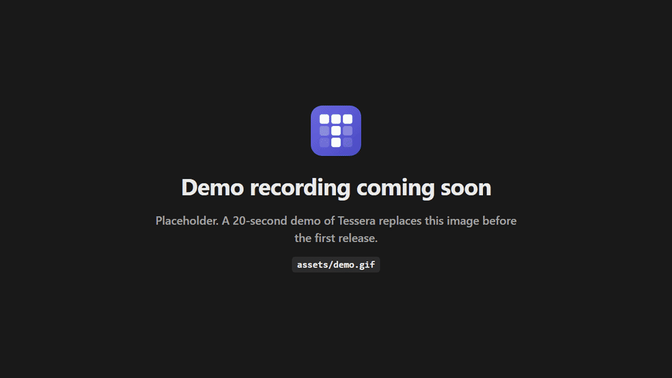
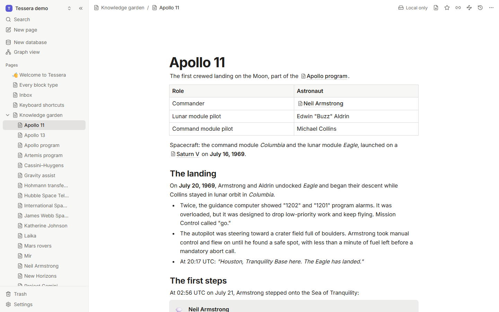
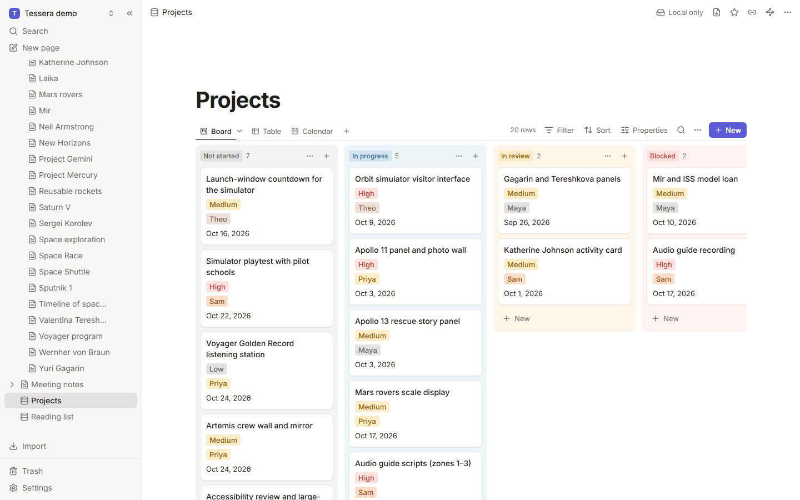
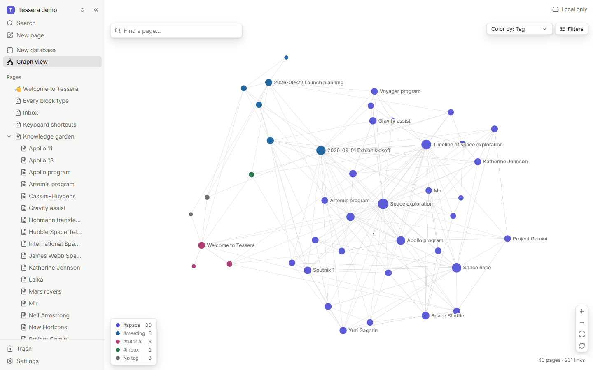
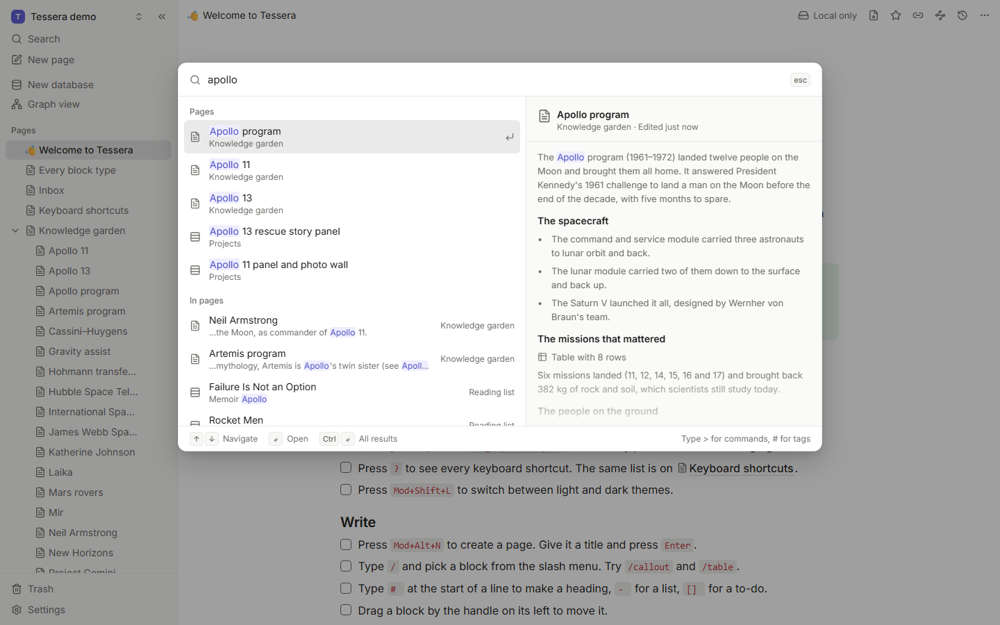
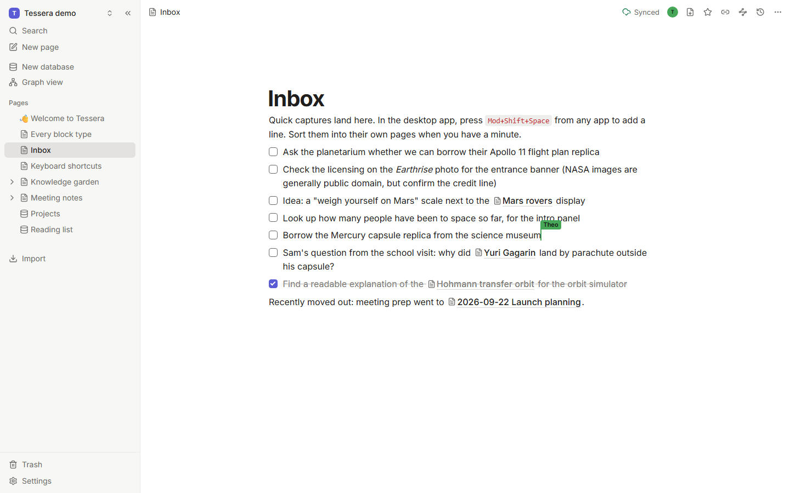
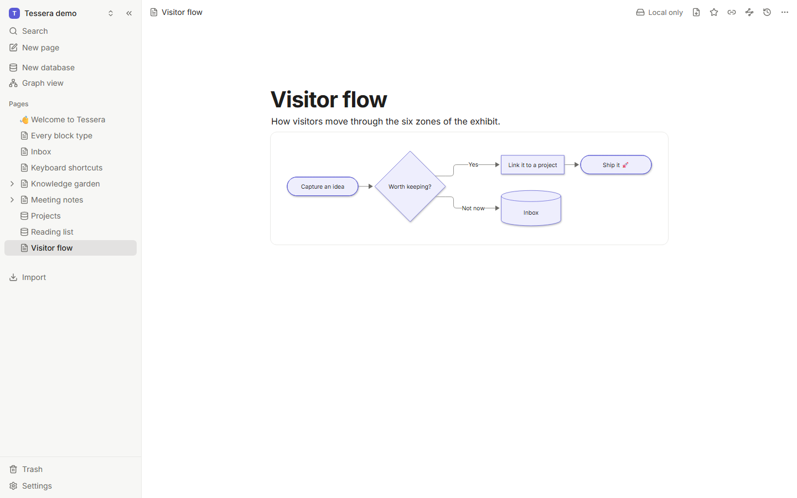
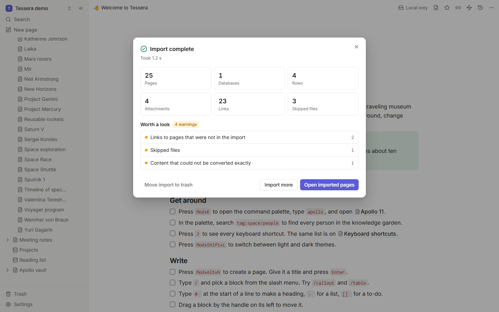
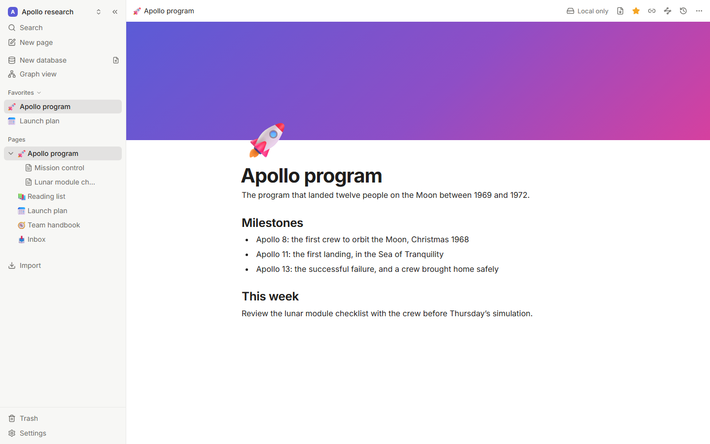
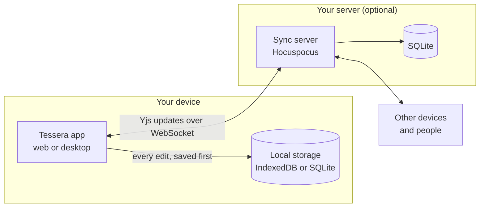

<a id="readme-top"></a>

<p align="center">
  <a href="https://github.com/femboypuppy/Tessera-Notes">
    <picture>
      <source media="(prefers-color-scheme: dark)" srcset="assets/brand/wordmark-dark.svg">
      <source media="(prefers-color-scheme: light)" srcset="assets/brand/wordmark-light.svg">
      
    </picture>
  </a>
</p>

<h1 align="center">Tessera Notes</h1>

<h3 align="center">Your notes, your server. Notion's power, Obsidian's freedom.</h3>

<p align="center">
  An open-source, local-first knowledge app: blocks and databases, <code>[[wikilinks]]</code> and a graph,<br>
  real-time collaboration and sandboxed plugins. On your device, on your own server.
</p>

<p align="center">
  <a href="https://github.com/femboypuppy/Tessera-Notes/stargazers"></a>
  <a href="https://github.com/femboypuppy/Tessera-Notes/forks"></a>
  <a href="https://github.com/femboypuppy/Tessera-Notes/releases/latest"></a>
  <a href="https://github.com/femboypuppy/Tessera-Notes/actions/workflows/ci.yml"></a>
  <a href="LICENSE"></a>
  <a href="https://github.com/femboypuppy/Tessera-Notes/pkgs/container/tessera"></a>
  <br>
  <a href="https://github.com/femboypuppy/Tessera-Notes/commits/main"></a>
  <a href="https://github.com/femboypuppy/Tessera-Notes/issues"></a>
  <a href="https://github.com/femboypuppy/Tessera-Notes/graphs/contributors"></a>
  <a href="https://github.com/femboypuppy/Tessera-Notes/discussions"></a>
</p>

<p align="center">
  <a href="https://femboypuppy.github.io/Tessera-Notes/"><strong>Docs</strong></a> ·
  <a href="https://github.com/femboypuppy/Tessera-Notes/releases/latest"><strong>Download</strong></a> ·
  <a href="https://femboypuppy.github.io/Tessera-Notes/self-hosting/"><strong>Self-host</strong></a> ·
  <a href="https://femboypuppy.github.io/Tessera-Notes/plugins/"><strong>Plugins</strong></a> ·
  <a href="#roadmap"><strong>Roadmap</strong></a> ·
  <a href="https://github.com/femboypuppy/Tessera-Notes/discussions"><strong>Discussions</strong></a>
</p>

<p align="center">
  
</p>

- **It's yours.** Your device holds the real data. Tessera works fully offline; a server is optional.
- **No lock-in.** Import Notion and Obsidian in one click. Export plain markdown any time.
- **Built to be extended.** Plugins run in a sandbox, with permissions you approve.

> [!NOTE]
> Tessera is an early release (0.1). It's ready to try and to build on, and there will be rough
> edges. Keep a backup of anything important, and please
> [tell us what breaks](https://github.com/femboypuppy/Tessera-Notes/issues/new/choose).

<details>
<summary><strong>Table of contents</strong></summary>

- [Features](#features)
- [Quickstart](#quickstart)
- [How it works](#how-it-works)
- [How Tessera compares](#how-tessera-compares)
- [Roadmap](#roadmap)
- [FAQ](#faq)
- [Contributing](#contributing)
- [Community and support](#community-and-support)
- [Star history](#star-history)
- [Acknowledgements](#acknowledgements)
- [License and contact](#license-and-contact)

</details>

## Features

<table>
  <tr>
    <td width="50%" valign="top">
      <picture>
        <source media="(prefers-color-scheme: dark)" srcset="assets/screenshots/showcase/write-dark.png">
        
      </picture>
      <p align="center"><strong>Write in blocks</strong><br><sub>Slash menu, markdown shortcuts, tables, callouts, toggles, code and embeds.</sub></p>
    </td>
    <td width="50%" valign="top">
      <picture>
        <source media="(prefers-color-scheme: dark)" srcset="assets/screenshots/showcase/board-dark.png">
        
      </picture>
      <p align="center"><strong>Databases with real views</strong><br><sub>Table, board, calendar, gallery and list views over typed properties.</sub></p>
    </td>
  </tr>
  <tr>
    <td width="50%" valign="top">
      <picture>
        <source media="(prefers-color-scheme: dark)" srcset="assets/screenshots/showcase/graph-dark.png">
        
      </picture>
      <p align="center"><strong>Links and a graph</strong><br><sub>Backlinks, unlinked mentions and a graph of everything you know.</sub></p>
    </td>
    <td width="50%" valign="top">
      <picture>
        <source media="(prefers-color-scheme: dark)" srcset="assets/screenshots/showcase/palette-dark.png">
        
      </picture>
      <p align="center"><strong>Find anything</strong><br><sub>One palette for pages, full-text results, tags and commands.</sub></p>
    </td>
  </tr>
  <tr>
    <td width="50%" valign="top">
      <picture>
        <source media="(prefers-color-scheme: dark)" srcset="assets/screenshots/showcase/collaboration-dark.png">
        
      </picture>
      <p align="center"><strong>Real-time collaboration</strong><br><sub>Live cursors and presence on your own server, and it all works offline.</sub></p>
    </td>
    <td width="50%" valign="top">
      <picture>
        <source media="(prefers-color-scheme: dark)" srcset="assets/screenshots/showcase/plugins-dark.png">
        
      </picture>
      <p align="center"><strong>Sandboxed plugins</strong><br><sub>Commands, panels and custom blocks with permissions you approve.</sub></p>
    </td>
  </tr>
  <tr>
    <td width="50%" valign="top">
      <picture>
        <source media="(prefers-color-scheme: dark)" srcset="assets/screenshots/showcase/import-dark.png">
        
      </picture>
      <p align="center"><strong>Move in, move out</strong><br><sub>Import Notion and Obsidian; export markdown, HTML, PDF or a backup.</sub></p>
    </td>
    <td width="50%" valign="top">
      <picture>
        <source media="(prefers-color-scheme: dark)" srcset="assets/screenshots/desktop/desktop-window-dark.png">
        
      </picture>
      <p align="center"><strong>Desktop apps</strong><br><sub>macOS, Windows and Linux, with each workspace in a folder you choose.</sub></p>
    </td>
  </tr>
</table>

<details>
<summary><strong>The full feature list</strong></summary>

<br>

**Write in blocks.** A block editor with a slash menu, markdown shortcuts, drag handles, tables,
callouts, toggles, code with syntax highlighting, images and embeds (YouTube, Vimeo, Loom, Figma,
CodePen). Type `[[` to link a page and `#` to tag it. Copy and paste keep their formatting.

**Databases with real views.** Table, board, calendar, gallery and list views over typed
properties: text, number, select, multi-select, date, checkbox, URL, email, relation, formula,
created and updated time. Filters with nested and/or groups, multi-level sorts, grouping,
summaries, row templates and CSV import and export. Inline databases inside any page.

**Links, backlinks and a graph.** Links follow renames. Backlinks show the sentence around each
link; unlinked mentions become links in one click. A global graph and a local graph for the
current page.

**Find anything.** <kbd>Ctrl</kbd>/<kbd>⌘</kbd>+<kbd>K</kbd> opens one palette for pages,
full-text results, tags and commands, with filters like `tag:space`, `in:Projects` and `is:task`.
Search runs in a worker, offline.

**Collaborate, or never go online.** Every edit is saved locally first. Sync uses Yjs CRDTs, so
offline edits merge without conflicts. Live cursors, presence, roles (owner, editor, viewer) and
version history on your own server.

**Plugins, safely sandboxed.** Commands, panels and custom blocks in sandboxed iframes, with
permissions you approve and can revoke. A typed SDK and `pnpm create tessera-plugin`.

**Move in, move out.** Import a Notion export, an Obsidian vault or a markdown folder with links,
databases and attachments. Export to Obsidian-compatible markdown, HTML, PDF or a full JSON
backup.

**Desktop and self-hosting.** Apps for macOS, Windows and Linux keep each workspace in a folder
you choose, with quick capture from anywhere. The server is one container with SQLite.

</details>

> [!TIP]
> The fastest way to look around: choose **Open the demo workspace** on the first screen. It has a
> project board, a reading list, meeting notes and a small knowledge garden about the history of
> space exploration, so the graph has something to show.

<p align="right"><a href="#readme-top">back to top ↑</a></p>

## Quickstart

Run the server and read its one-time setup code:

```bash
docker run -d --name tessera -p 8787:8787 -v tessera-data:/data ghcr.io/femboypuppy/tessera:latest
docker logs tessera
```

Then open `http://localhost:8787`, choose **Join a workspace on a server**, and create the owner
account with that code.

Prefer a native app? Download it for macOS, Windows or Linux from the
[latest release](https://github.com/femboypuppy/Tessera-Notes/releases/latest).

<details>
<summary><strong>All install methods</strong></summary>

<br>

**Desktop app.** Download the installer for your system from the
[latest release](https://github.com/femboypuppy/Tessera-Notes/releases/latest) and open it. Each
workspace is a folder on your disk, and everything works offline.

**Docker Compose**, with a restart policy and optional automatic HTTPS through Caddy:

```bash
mkdir tessera && cd tessera
curl -fsSLO https://raw.githubusercontent.com/femboypuppy/Tessera-Notes/main/docker-compose.yml
docker compose up -d
```

A minimal compose file, if you'd rather write your own:

```yaml
services:
  tessera:
    image: ghcr.io/femboypuppy/tessera:latest
    restart: unless-stopped
    ports:
      - "8787:8787"
    volumes:
      - tessera-data:/data
    environment:
      PUBLIC_URL: https://notes.example.com
      SIGNUP_MODE: invite
volumes:
  tessera-data:
```

**Web app.** Once a server runs, open its address in any modern browser. The web app keeps your
workspace in the browser and syncs when it's online.

**From source** (Node 24 and pnpm 11):

```bash
git clone https://github.com/femboypuppy/Tessera-Notes.git && cd Tessera-Notes
corepack enable
pnpm install
pnpm dev
```

The [installation guide](https://femboypuppy.github.io/Tessera-Notes/guide/installation) covers each
option in detail.

</details>

> [!IMPORTANT]
> Before anyone signs in over the internet, put the server behind HTTPS and keep sign-ups
> invite-only (`SIGNUP_MODE=invite`). The
> [self-hosting guide](https://femboypuppy.github.io/Tessera-Notes/self-hosting/) covers HTTPS, every
> setting, and [backups](https://femboypuppy.github.io/Tessera-Notes/self-hosting/backups).

> [!WARNING]
> A workspace that lives only in a browser is as durable as that browser profile: clearing site
> data deletes it. For anything you'd hate to lose, use the desktop app or sync to a server.

<p align="right"><a href="#readme-top">back to top ↑</a></p>

## How it works



- **Every page is a [Yjs](https://github.com/yjs/yjs) document.** Edits are written to your
  device before they go anywhere, and changes from different people merge without conflicts.
- **The server is optional.** It stores updates and forwards them to other clients; your devices
  keep working without it.
- **Features plug in.** The editor, databases, search, sync and plugins are separate modules on one
  small core. The [architecture guide](https://femboypuppy.github.io/Tessera-Notes/contributing/architecture)
  and [SPEC.md](SPEC.md) explain the details.

## How Tessera compares

Tessera is new; the products below are mature and polished. This compares what each one can do,
not how refined it is. Last checked **2026-09-23** against each product's own docs, pricing page
and license. ✅ yes · ⚠️ partly · ❌ no

|                            | Tessera | Notion | Obsidian | Anytype | AFFiNE | Logseq |
| -------------------------- | :-----: | :----: | :------: | :-----: | :----: | :----: |
| Open source                | ✅ MIT | ❌ | ❌ | ⚠️ <sup>1</sup> | ⚠️ <sup>2</sup> | ✅ AGPL-3.0 |
| Local-first, works offline | ✅ | ❌ <sup>3</sup> | ✅ | ✅ | ✅ | ✅ |
| Self-hostable sync         | ✅ | ❌ | ❌ <sup>4</sup> | ✅ | ✅ | ⚠️ <sup>5</sup> |
| Real-time collaboration    | ✅ | ✅ | ❌ | ⚠️ <sup>6</sup> | ✅ | ⚠️ <sup>7</sup> |
| Databases (typed views)    | ✅ | ✅ | ✅ | ✅ | ✅ | ⚠️ <sup>7</sup> |
| Plugins                    | ✅ | ⚠️ <sup>8</sup> | ✅ | ❌ | ❌ | ✅ |
| Graph view                 | ✅ | ❌ | ✅ | ✅ | ❌ | ✅ |
| Price                      | Free | Free; Plus $10/seat/mo | Free; Sync $4/mo | Free; paid from $4/mo | Free; Pro $6.75/mo | Free |

**Notes**

1. Anytype's apps use the Any Source Available License, which isn't OSI-approved. Its sync protocol and server (any-sync) are MIT.
2. AFFiNE's editor and apps are MIT; its backend is under the AFFiNE Enterprise Edition license, with a free self-hosted community edition.
3. Notion offers offline access to pages you download ahead of time. It is cloud-first.
4. Obsidian Sync is a paid hosted service. Community plugins can sync through your own storage.
5. The Logseq repository includes a sync server for the database version, but the official roadmap still lists self-hosted sync as planned.
6. Anytype shares spaces between members and syncs changes when they're online; simultaneous editing of one object isn't documented.
7. Real-time collaboration and typed database properties are part of the Logseq database version, in beta since 2026.
8. Notion has a public API for integrations, but no plugins that run inside the app.

Prices are the lowest paid tier, billed yearly, in USD. Spotted something out of date?
[Open an issue](https://github.com/femboypuppy/Tessera-Notes/issues/new/choose) and we'll fix it.

<p align="right"><a href="#readme-top">back to top ↑</a></p>

## Roadmap

Tessera 0.1 covers everything above. Next, roughly in order (follow along in
[issues labeled `roadmap`](https://github.com/femboypuppy/Tessera-Notes/issues?q=is%3Aissue+label%3Aroadmap)):

- Comments and @-mentions
- Public sharing and per-page permissions
- End-to-end encryption for synced workspaces
- Importers for Logseq, Bear and Evernote
- Native mobile apps (the web app already works at phone width)

## FAQ

<details>
<summary><strong>Is Tessera free?</strong></summary>

<br>

Yes. It's open source under the [MIT license](LICENSE). There's no paid plan, no account with us
and no telemetry. Running a server costs whatever your hosting costs.

</details>

<details>
<summary><strong>Where is my data?</strong></summary>

<br>

On your device: in a folder you choose (desktop app) or in the browser's storage (web app). If you
connect a server, a copy lives on that server too, and you run it.

</details>

<details>
<summary><strong>Do I need a server? Is there a hosted version?</strong></summary>

<br>

No server is needed: Tessera works fully offline on one device. You need one only to sync devices
or work with other people, and it's a single container. There's no Tessera cloud; a small VPS or a
home server runs it comfortably.

</details>

<details>
<summary><strong>Is my data encrypted?</strong></summary>

<br>

Traffic between the apps and your server uses HTTPS. Data at rest is stored as-is on your device
and your server, so use disk encryption. End-to-end encryption is on the [roadmap](#roadmap).

</details>

<details>
<summary><strong>Can I use my Obsidian vault directly?</strong></summary>

<br>

Tessera imports vaults rather than editing the files in place, so that sync and collaboration can
merge edits safely. You can export back to Obsidian-compatible markdown at any time, and the
desktop app can keep a live markdown copy of each workspace.

</details>

<details>
<summary><strong>How do plugins stay safe?</strong></summary>

<br>

Each plugin runs in its own sandboxed iframe with no access to the app, your storage or your
cookies. It can only call the APIs for the permissions you approved, and you can revoke them at any
time.

</details>

<details>
<summary><strong>Is there a mobile app?</strong></summary>

<br>

Not yet. The web app works on phones and tablets; native apps are on the [roadmap](#roadmap).

</details>

More answers in the [FAQ](https://femboypuppy.github.io/Tessera-Notes/guide/faq) and
[troubleshooting](https://femboypuppy.github.io/Tessera-Notes/guide/troubleshooting) guides.

<p align="right"><a href="#readme-top">back to top ↑</a></p>

## Contributing

Tessera is a friendly place for a first contribution. Read [CONTRIBUTING.md](CONTRIBUTING.md) for
the dev setup and a tour of the repo, then pick a
[good first issue](https://github.com/femboypuppy/Tessera-Notes/issues?q=is%3Aissue+is%3Aopen+label%3A%22good+first+issue%22).
Plugins are welcome too: `pnpm create tessera-plugin my-plugin` scaffolds one.

<a href="https://github.com/femboypuppy/Tessera-Notes/graphs/contributors">
  
</a>

## Community and support

- **Questions and ideas:** [GitHub Discussions](https://github.com/femboypuppy/Tessera-Notes/discussions)
- **Bugs and feature requests:** [Issues](https://github.com/femboypuppy/Tessera-Notes/issues/new/choose)
- **Security reports:** privately, through
  [GitHub security advisories](https://github.com/femboypuppy/Tessera-Notes/security/advisories/new)
- Everyone taking part follows the [Code of Conduct](CODE_OF_CONDUCT.md).

## Star history

If Tessera is useful to you, or you'd like to see where it goes,
**⭐ [star the repo](https://github.com/femboypuppy/Tessera-Notes)**. It helps other people find it,
and it makes our day.

<a href="https://star-history.com/#femboypuppy/Tessera-Notes&Date">
  <picture>
    <source media="(prefers-color-scheme: dark)" srcset="https://api.star-history.com/svg?repos=femboypuppy/Tessera-Notes&type=Date&theme=dark">
    <source media="(prefers-color-scheme: light)" srcset="https://api.star-history.com/svg?repos=femboypuppy/Tessera-Notes&type=Date">
    
  </picture>
</a>

## Acknowledgements

Tessera stands on the shoulders of excellent open-source projects:
[Yjs](https://github.com/yjs/yjs) ·
[TipTap](https://github.com/ueberdosis/tiptap) ·
[ProseMirror](https://prosemirror.net) ·
[Hocuspocus](https://github.com/ueberdosis/hocuspocus) ·
[Tauri](https://tauri.app) ·
[MiniSearch](https://github.com/lucaong/minisearch) ·
[sigma.js](https://www.sigmajs.org) ·
[graphology](https://graphology.github.io) ·
[unified and remark](https://unified.js.org) ·
[React](https://react.dev) ·
[Vite](https://vite.dev) ·
[Radix UI](https://www.radix-ui.com) ·
[Tailwind CSS](https://tailwindcss.com) ·
[TanStack Table and Virtual](https://tanstack.com) ·
[dnd kit](https://dndkit.com) ·
[Hono](https://hono.dev) ·
[SQLite](https://sqlite.org) and [better-sqlite3](https://github.com/WiseLibs/better-sqlite3) ·
[DOMPurify](https://github.com/cure53/DOMPurify) ·
[Zod](https://zod.dev) ·
[Lucide](https://lucide.dev) ·
[Inter](https://rsms.me/inter/) ·
[Playwright](https://playwright.dev) ·
[Vitest](https://vitest.dev) ·
[VitePress](https://vitepress.dev).

## License and contact

Tessera is released under the [MIT License](LICENSE). Your notes stay yours, and so does the code.

Curious how it was made? [BUILT_WITH_AGENTS.md](BUILT_WITH_AGENTS.md) describes how the first
version was built by parallel AI agents working from written briefs.

**Contact:** [femboypuppy@tutanota.de](mailto:femboypuppy@tutanota.de) · Security issues: please
use [private security advisories](https://github.com/femboypuppy/Tessera-Notes/security/advisories/new).

<p align="right"><a href="#readme-top">back to top ↑</a></p>
