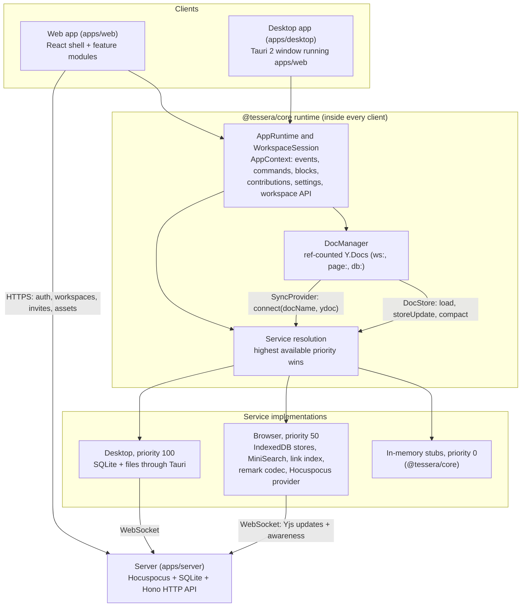

# Tessera specification

This document is the contract for everyone building Tessera. It explains what we build, how the
pieces fit, and exactly how your part plugs in. The code in `packages/core` is the source of
truth: if this document and the code disagree, the code wins. File a *Contract change request* in
your HANDOFF file (see [Merge plan](#12-merge-plan)) and keep going with a local workaround.

Contents: [1. Vision](#1-vision) · [2. Scope](#2-scope) · [3. Architecture](#3-architecture) ·
[4. Data model](#4-data-model) · [5. Document schema](#5-document-schema) ·
[6. Runtime and interfaces](#6-runtime-and-interfaces) · [7. App shell](#7-app-shell) ·
[8. Design system](#8-design-system-packagesui) · [9. Ownership and conventions](#9-ownership-and-conventions) ·
[10. Performance budgets](#10-performance-budgets) · [11. Security](#11-security) ·
[12. Merge plan](#12-merge-plan) · [13. Stack and decisions](#13-stack-and-decisions)

## 1. Vision

**Tessera is an open-source, local-first knowledge app: Notion's blocks and databases, Obsidian's
links and graph, real-time collaboration and plugins, on your own device and your own server.**

- **Local-first, literally.** The app works fully offline. Your device holds the real data; a
  server is optional and only syncs.
- **Never lose data.** Every keystroke is persisted before anything else happens. Sync converges.
  Destructive actions can be undone or are confirmed.
- **No lock-in.** Import from Notion and Obsidian in one click, export to plain markdown any time.
- **Fast and calm.** Instant startup, no layout shift, quiet UI in the spirit of Linear and Notion.
- **Safe to extend.** Plugins run sandboxed with explicit permissions.

The bar: someone who tries it for five minutes wants to star it.

## 2. Scope

### v1 (0.1.0) scope

| Area | What ships | Agent |
|---|---|---|
| Shell | Sidebar with page tree (drag and keyboard reorder and nest), favorites, trash, top bar with breadcrumbs, settings, onboarding, shortcuts overlay, light and dark themes, phone layout | 01 |
| Editor | TipTap block editor on Yjs implementing the canonical schema: slash menu, markdown shortcuts, block handle and drag, tables, callouts, toggles, code, images, embeds, `[[links]]`, `#tags`, clipboard, collaboration cursors | 02 |
| Storage and sync | IndexedDB persistence, multi-tab, Hocuspocus server with SQLite, auth and roles, presence, version history | 03 |
| Databases | Query engine, table, board, calendar, gallery and list views, every property type, CSV import and export, inline databases | 04 |
| Search and graph | MiniSearch index in a worker, command palette, backlinks and unlinked mentions, global and local graph | 05 |
| Plugins | Sandboxed iframe host, typed RPC, permissions, SDK, registry, five example plugins, scaffolder | 06 |
| Desktop and self-hosting | Tauri 2 app with SQLite, workspaces as folders, quick capture, updater; Dockerfile, compose, deploy guides | 07 |
| Markdown, import and export | remark codec with Obsidian syntax, Notion, Obsidian and markdown importers, markdown zip, JSON backup, HTML and PDF export | 08 |
| Quality | CI workflows, seeded workspace generator, journeys, benchmarks, bundle budgets, axe checks | 09 |
| Docs and launch | README, VitePress docs, brand, demo workspace, launch kit | 10 |

### Non-goals for v1

- Native mobile apps. The web app works at phone width; there are no iOS or Android builds.
- End-to-end encryption. The server stores Yjs updates as they are; TLS protects them in transit.
- Per-page permissions or public sharing. Roles (owner, editor, viewer) apply to a whole workspace.
- Comments, @-mentions of people, notifications, reminders.
- AI features.
- Custom node or mark types from plugins. Plugins extend the document only through `embed` blocks.
- Rewinding CRDT history. "Restore version" writes the old content as a new edit.
- Federation between servers.
- Importers beyond Notion, Obsidian and markdown folders (Logseq, Bear, Evernote are stretch goals).
- A formula language (a stretch goal for Agent 04; the `formula` property type is reserved).

## 3. Architecture



**How an edit flows.** The editor changes the page's `Y.Doc`. The `DocManager` sees the update and
calls `DocStore.storeUpdate` right away (retrying on failure), so the edit is durable locally. The
`SyncProvider` sends it to the server, which persists it and fans it out to other clients. The
runtime derives events (`doc.changed` for content, `page.*` for metadata), and the search and link
indexes update from them. Remote edits arrive the same way in reverse and fire the same events with
`local: false`.

**Layers.**

- `packages/core`: contracts, data model helpers, schema, stubs and the runtime. No DOM needed
  (React bindings are in `@tessera/core/react`).
- `packages/ui`: design tokens, components and `t()`.
- Feature packages (`editor`, `sync`, `db-views`, `search`, `plugins`, `plugin-api`, `markdown`,
  `importers`, `testkit`): each depends only on `core`, `ui` and its own libraries. A package never
  imports another agent's package. The one allowed exception is within an agent: `importers` may
  use `markdown`, `plugins` may use `plugin-api`.
- `apps/web`: the shell. It loads every feature through `apps/web/src/features/<area>/index.ts`.
  `apps/web` depends on every internal package, so a feature can import its own package without
  editing `apps/web/package.json`.
- `apps/desktop`: the Tauri app wrapping `apps/web`. `apps/server`: the sync and API server, which
  also serves the built web app.

## 4. Data model

All document state lives in Yjs. Everything else (UI state, caches) is derived. Other packages
never touch raw `Y.Map`s of core docs: they use the typed helpers, which validate input, run in one
transaction, and throw typed errors (`NotFoundError`, `ValidationError`, `InvalidOperationError`,
all subclasses of `TesseraError` with a stable `code`).

### 4.1 Identifiers, time and order

| Thing | Rule | Helpers |
|---|---|---|
| IDs (pages, databases, properties, options, views, workspaces, assets) | nanoid(21) from `newId()`. Accepted: `ID_PATTERN` (`[A-Za-z0-9_-]{1,64}`). | `newId`, `isValidId` |
| Block IDs (`blockId` attribute) | Short URL-safe IDs, `BLOCK_ID_PATTERN`. | `newBlockId`, `isValidBlockId` |
| Timestamps | Epoch milliseconds (`Date.now()`). | |
| Order | Fractional index strings. Sort by `order`, then `id` as a tie-break. | `compareOrdered`, `sortOrdered`, `orderBetween`, `ordersBetween`, `orderForIndex`, `orderAfterAll`, `positionToIndex` |
| Positions | `ListPosition = 'start' \| 'end' \| { index } \| { before: id } \| { after: id }` | used by pages, rows, properties, options, views |

### 4.2 Doc names

| Doc | Name | Helper |
|---|---|---|
| Workspace | `ws:<workspaceId>` | `workspaceDocName(id)` |
| Page | `page:<pageId>` | `pageDocName(id)` |
| Database | `db:<databaseId>` (same ID as the database page) | `databaseDocName(id)` |

`parseDocName(name)` returns `{ kind, id }`. Doc names are what `DocStore`, `SyncProvider` and the
server see.

### 4.3 Workspace doc (`ws:<id>`)

| Key | Type | Holds |
|---|---|---|
| `pages` | `Y.Map<pageId, Y.Map<field, value>>` | One nested map per page, so concurrent edits to different fields of the same page merge. |
| `settings` | `Y.Map<key, JsonValue>` | Workspace settings shared with collaborators (`ctx.settings.workspace`). |
| `meta` | `Y.Map` | `schemaVersion` (`DATA_MODEL_VERSION`, currently 1) and `createdAt`, written once by `initWorkspaceDoc`. |

**`PageMeta`** (one entry of `pages`):

| Field | Type | Notes |
|---|---|---|
| `id` | string | Also the ID of the page doc and, for databases, of the database doc. |
| `kind` | `'page' \| 'database'` | `database` pages render a database; their child pages are its rows. |
| `title` | string | Plain text, at most 2,000 characters, no line breaks. Empty means "Untitled": render `t()`'s "Untitled", never store it. |
| `icon?` | string | One emoji (one grapheme). |
| `cover?` | `PageCover` | `{ kind: 'preset' \| 'asset' \| 'url', value, positionY? }`. Presets come from `packages/ui` (`COVER_PRESETS`); `url` must be `https:`. |
| `parentId` | string or null | null = top level. |
| `order` | string | Fractional index among siblings. |
| `createdAt`, `updatedAt` | number | `updatedAt` also moves on content edits (debounced, see 6.1). |
| `createdBy?`, `updatedBy?` | string | User IDs. |
| `trashedAt?`, `trashedBy?` | number, string | Set only on the page the user trashed. |
| `favorite?` | boolean | Shown under Favorites. |

Rules:

- **Titles live in `PageMeta`,** so the sidebar, search, link autocomplete and breadcrumbs never
  load page docs. The page header edits `PageMeta.title`; `pageLink` nodes store only the target ID
  and render the current title, so renames propagate.
- **Trash is implicit for descendants.** Trashing a page sets `trashedAt` on that page only; every
  descendant counts as trashed (`isTrashed`) and comes back with it. `trashPage` and `restorePage`
  return a `TrashChange` listing every affected page. Restoring a page whose parent is still in the
  trash moves it to the top level.
- **Robust tree.** Pages whose parent is missing are shown at the top level. Parent cycles (possible
  after concurrent moves) are broken deterministically: the page with the smallest ID becomes a
  root. Every client computes the same tree.
- **Database rows are pages.** A row is a page whose `parentId` is a database page. `rowId === pageId`.
  Its title is the database's title column. Rows never show in the sidebar tree; they cannot be
  moved with `movePage` (their order lives in the database doc). Create rows with
  `ctx.workspace.addDatabaseRow`.
- **Page docs are created lazily**, the first time something writes to them.
- **Permanent deletion** (`deletePagePermanently`, `emptyTrash`) removes the subtree from the
  workspace doc, deletes the page and database docs from the `DocStore`, and removes row entries
  from their database. Only trashed pages can be deleted permanently from the UI, always after a
  confirmation.

Workspace helpers (pure functions over a `Y.Doc`, also bound to the session as `ctx.workspace`):
`createPage`, `createPages` (many pages in one transaction with one page index: O(n) instead of
n × O(n); importers use it), `renamePage`, `movePage`, `setIcon`, `setCover`, `setFavorite`, `touchPage`,
`trashPage`, `restorePage`, `deletePagePermanently`, `emptyTrash`, `getPage`, `requirePage`,
`listPages`, `getChildren`, `getAncestors`, `getDescendants`, `isPageTrashed`, `isDatabaseRow`,
`listTrash`, `indexPages`, `observePages`. `createPageIndex(pages)` builds the queryable index
(`tree`, `children`, `ancestors`, `descendants`, `favorites`, `trash`, `isTrashed`, `isRow`,
`effectiveParentId`) that `usePages()` returns.

### 4.4 Page doc (`page:<id>`)

| Key | Type | Holds |
|---|---|---|
| `content` | `Y.XmlFragment` | The ProseMirror document in the canonical schema ([section 5](#5-document-schema)). Only the editor binds to it directly; everyone else uses `readDocJSON` and `writeDocJSON`. |
| `props` | `Y.Map<key, JsonValue>` | Page properties. Well-known keys: `tags` (string[], without `#`), `aliases` (string[], used for link resolution and unlinked mentions), `fullWidth` (boolean), `smallText` (boolean). Other keys are imported frontmatter, kept so exports can write it back. |

Helpers: `getPageContent`, `getPageProps`, `getPageProp`, `setPageProp`, `setPageProps`,
`observePageProps`.

### 4.5 Database doc (`db:<id>`)

| Key | Type | Holds |
|---|---|---|
| `schema` | `Y.Map<propertyId, Y.Map>` | Property definitions; select options in a nested `options` map. |
| `views` | `Y.Map<viewId, Y.Map<field, JSON>>` | View configurations, one nested map per view so fields merge. |
| `rows` | `Y.Map<rowId, Y.Map>` | `{ order, values: Y.Map<propertyId, JSON>, valuesUpdatedAt?, valuesUpdatedBy? }` |
| `meta` | `Y.Map` | `schemaVersion`, `createdAt`, `rowTemplateId` (a page copied into new rows). |

Row **values live in the database doc** so views can filter, sort and group without loading any
row page. A row's body is an ordinary page doc. `resolveRows(listRows(db), pages)` joins rows with
their `PageMeta` (title, icon, timestamps) and flags `trashed` rows (views hide them) and
`missingPage` rows (metadata not synced yet); `getCellValue(row, property)` reads any column,
including `title`, `createdTime` and `updatedTime`.

**Property types** (`PROPERTY_TYPES`):

| Type | Stored value | Notes |
|---|---|---|
| `title` | none (`PageMeta.title`) | Exactly one per database. |
| `text` | string | Up to 100,000 characters. |
| `number` | finite number | `NumberConfig`: `plain`, `percent` (stores ratios: 0.25 shows 25%), `currency` (ISO 4217), precision. |
| `select` | option ID | Options: `{ id, name, color: TagColor, order }`. |
| `multiSelect` | option IDs (unique, in pick order) | |
| `date` | `DateValue` | `{ start, end?, includeTime?, timeZone? }`. Date-only values are `YYYY-MM-DD`; with time, ISO 8601 instants with an offset. `DateConfig` sets the display format. |
| `checkbox` | boolean | Missing means unchecked. |
| `url`, `email` | string | Render safely (`isSafeHref`). |
| `relation` | page IDs | `RelationConfig`: `targetDatabaseId` (or null for any page), `backPropertyId` for two-way relations, `limit: 'one' \| 'many'`. |
| `createdTime` | none (`PageMeta.createdAt`) | |
| `updatedTime` | none (later of the page's `updatedAt` and the row's `valuesUpdatedAt`) | |
| `formula` | none (computed) | Reserved. Offer it only once a formula engine exists. |

Changing a property's type keeps its type-specific config (switching select, then text, then
select restores the options). Stored values that no longer validate after a type change are
treated as empty and left in place, so switching back restores them. `propertyValueSchemas` and
`validatePropertyValue` validate values with zod; `TAG_COLORS` names map to theme tokens
(`bg-tag-<color>-bg`, `text-tag-<color>-fg`). Never store raw CSS colors.

**Views** (`ViewConfig`): `id`, `name`, `type` (`table`, `board`, `calendar`, `gallery`, `list`),
`order`, `filter` (a `FilterGroup`: nested `and`/`or` groups of conditions, operators per property
type in `FILTER_OPERATORS_BY_TYPE`, relative dates in `RELATIVE_DATE_RANGES`), `sorts` (`SortRule[]`),
`group` (`GroupConfig`, empty group key `EMPTY_GROUP_KEY`), `properties` (per-view visibility,
width and order), `summaries` (`SUMMARY_KINDS`) and type-specific options (`TableOptions`,
`BoardOptions`, `CalendarOptions`, `GalleryOptions`, `ListOptions`). These are types only: the
query engine belongs to Agent 04 (`packages/db-views/src/query`).

Database helpers (all transactional, validate before writing, tested): `initDatabaseDoc`,
`getDatabaseMeta`, `setRowTemplate`, `listProperties`, `getProperty`, `getTitleProperty`,
`addProperty`, `updateProperty`, `deleteProperty`, `moveProperty`, `findSelectOption`,
`addSelectOption`, `updateSelectOption`, `deleteSelectOption`, `moveSelectOption`, `listRows`,
`getRow`, `countRows`, `addRow`, `addRows` (many rows in one transaction, validated first),
`checkRowValues`, `setRowValue`, `setRowValues`, `deleteRow`, `moveRow`,
`resolveRows`, `getCellValue`, `listViews`, `getView`, `addView`, `updateView`, `deleteView`,
`duplicateView`, `moveView`, `observeDatabase`. Deleting a property also removes it from every
view's filter, sorts, grouping and property list.

Create databases and rows through the session so the page and the database doc stay consistent:

```ts
const { page, titlePropertyId, viewId } = await ctx.workspace.createDatabase({
  title: t('db-views:readingList'), titlePropertyName: t('db-views:name'), viewName: t('db-views:table'),
});
const row = await ctx.workspace.addDatabaseRow(page.id, { title: 'Dune', values: { [statusId]: optionId } });
// Many rows (CSV import, paste): one workspace and one database transaction, nothing left on error.
const rows = await ctx.workspace.addDatabaseRows(page.id, csvRows, { after: row.id });
```

### 4.6 Settings

| Store | Where | Synced | Use for |
|---|---|---|---|
| `ctx.settings.device` | `localStorage`, keys prefixed `tessera:device:` (`LocalStorageSettingsStore`) | No | Theme, sidebar width, per-device preferences |
| `ctx.settings.workspace` | The workspace doc's `settings` map | Yes, with collaborators | Workspace-wide preferences |

Values are JSON. Keys are `<featureId>.<name>` (`backlinks.showFooter`, `editor.spellcheck`).
Well-known keys are in `SETTING_KEYS`: `shell.theme` (`light`, `dark`, `system`), `shell.language`,
`shell.sidebarOpen`, `shell.sidebarWidth`, `user.id`, `user.name`, `user.color`. Both stores fire
`settings.changed`; `useSetting(store, key, fallback)` reads and writes reactively.

**The current user** is device-wide: `{ id, name, color }`. `id` is a nanoid created on first run
and stored in `user.id`. The sync feature sets `user.id` to the account ID after signing in; the
runtime reads it live, fires `user.changed` and updates awareness. Authorship fields (`createdBy`,
`updatedBy`, `trashedBy`) use whatever `id` is current.

### 4.7 Versions

`DATA_MODEL_VERSION` (1) versions the Y.Doc layout; `DOC_SCHEMA_VERSION` (1) versions the document
schema. Both are stamped when docs are created. A breaking change bumps them and ships a migration
in `packages/core`. Indexes persisted by Agent 05 must rebuild when either changes.

## 5. Document schema

`packages/core/src/schema` defines the canonical ProseMirror schema (`tesseraSchema`, no DOM). The
editor implements exactly this schema, the markdown codec produces exactly this schema, and the
indexers parse exactly this schema. Its machine-readable description is exported as
`SCHEMA_DESCRIPTION` and checked in as `packages/core/src/schema/schema-description.json`; the
editor's conformance test compares TipTap's schema against it with `diffSchemaDescriptions`.

### 5.1 Nodes

Every block that can be linked, colored or dragged has a `blockId` attribute (null until someone
needs a stable reference; the editor assigns IDs to new blocks).

| Node | Group | Content | Attributes (default) |
|---|---|---|---|
| `doc` | | `block+` | |
| `paragraph` | block | `inline*` | `blockId` (null), `color` (null) |
| `heading` | block | `inline*` | `level` (1; 1–3), `blockId`, `color` |
| `blockquote` | block | `block+` | `blockId`, `color` |
| `callout` | block | `block+` | `emoji` ('💡'), `tone` ('default'; `CALLOUT_TONES`: default, info, success, warning, danger), `blockId` |
| `codeBlock` | block | `text*`, no marks | `language` (null; `[a-z0-9_+#.-]{1,64}`), `blockId` |
| `horizontalRule` | block | leaf | |
| `image` | block | atom | `assetId`, `src`, `alt`, `title`, `width` (all null), `blockId`. Needs `assetId` or a safe `src`. |
| `bulletList` | block, list | `listItem+` | |
| `orderedList` | block, list | `listItem+` | `start` (1) |
| `listItem` | | `paragraph block*` | `blockId`, `color` |
| `taskList` | block, list | `taskItem+` | |
| `taskItem` | | `paragraph block*` | `checked` (false), `blockId`, `color` |
| `table` | block | `tableRow+` | `blockId` |
| `tableRow` | | `(tableCell \| tableHeader)*` | |
| `tableHeader` | | `paragraph+` | `colspan` (1), `rowspan` (1), `colwidth` (null) |
| `tableCell` | | `paragraph+` | `colspan` (1), `rowspan` (1), `colwidth` (null) |
| `toggle` | block | `toggleSummary block*` | `open` (false), `blockId`, `color` |
| `toggleSummary` | | `inline*` | |
| `embed` | block | atom | `kind` (null), `ref` (null), `data` (null), `blockId` |
| `text` | inline | | |
| `pageLink` | inline | atom | `pageId` (null), `label` (null), `heading` (null), `blockRef` (null) |
| `tag` | inline | atom | `name` (null) |
| `hardBreak` | inline | leaf | |

### 5.2 Marks

| Mark | Attributes | Notes |
|---|---|---|
| `bold`, `italic`, `underline`, `strike` | | |
| `code` | | Excludes every other mark. |
| `link` | `href` (null), `title` (null) | Not inclusive. `href` must pass `isSafeHref` (http, https, mailto, tel, relative). |
| `highlight` | `color` (null = yellow) | `TEXT_COLORS` names. |

Block colors (`color` attribute) are `BLOCK_COLORS`: a text color (`red`) or a background
(`red-background`).

### 5.3 Embeds, links and tags

- **`embed` is the only extension block.** Anything that isn't core text formatting is an embed:
  - `kind: 'database'`: `ref` = database ID, `data` = `{ viewId }` (an inline database or linked view).
  - `kind: 'web'`: `ref` = the URL (YouTube, Vimeo, Loom, Figma, CodePen, or a link card).
  - `kind: 'file'`: `ref` = asset ID (attachments).
  - `kind: 'plugin:<pluginId>/<blockType>'`: `data` = the plugin's JSON (`pluginBlockKind(id, type)`).
  Kinds match `EMBED_KIND_PATTERN`; `data` is JSON of at most 64 KB (`MAX_EMBED_DATA_BYTES`). An
  unknown kind renders a "This block needs a plugin" placeholder and never crashes.
- **`pageLink`** stores the target `pageId`, plus an optional `label` (alias text), `heading`
  (link to a heading) and `blockRef` (link to a block ID). Renderers show the target's current
  title (or the label), a broken style for missing or trashed targets, and navigate with
  `ctx.navigate(pageId, { heading, blockId: blockRef })`.
- **`tag`** stores `name` without `#`. Names match `TAG_NAME_PATTERN` (letters, digits, `_`, `-`,
  `/` for nesting). `tagKey(name)` is the case-insensitive key for search; `tagHierarchy('a/b')`
  returns `['a', 'a/b']`.

### 5.4 DocJSON utilities

`DocJSON` is ProseMirror JSON for this schema (typed node by node: `ParagraphJSON`, `EmbedJSON`, …).

| Function | What it does |
|---|---|
| `readDocJSON(ydoc)` | Reads a page doc's content as normalized DocJSON. |
| `writeDocJSON(ydoc, json, { origin? })` | Replaces the content in one transaction (validates first). |
| `updateDocJSON(ydoc, update)` | Read, transform, write. |
| `createDocFromJSON(json)` | A new Y.Doc holding the content. |
| `validateDocJSON(json)` | `{ ok: true, doc, node }` or `{ ok: false, errors }`, against the schema and the attribute rules. |
| `normalizeDocJSON(input)` | Repairs anything close to valid (wraps inline content, drops unknown attributes, merges text). Importers and codecs call it last. |
| `docJSONToNode`, `docJSONEqual`, `isDocJSON`, `emptyDocJSON`, `isDocEmpty`, `walkDocJSON`, `nodeAtPath` | Helpers. |
| `extractPlainText`, `extractTextBlocks`, `extractHeadings` (with `headingSlug`) | Text for search and outlines. |
| `extractLinks` | Target page ID, label, heading, block ref and the text of the containing block. |
| `extractTags`, `extractTasks`, `extractEmbeds`, `extractImages`, `extractAssetIds` | |
| `findTextOccurrences`, `replaceTextWithPageLink` | Unlinked mentions and "Link" conversion. |
| `build` (`b.doc`, `b.paragraph`, `b.pageLink`, …), `kitchenSinkDoc`, `FIXTURE_IDS` | Builders and a fixture with every node and mark (in `@tessera/core/testing`). |

```ts
const handle = await ctx.loadPageDoc(pageId);
try {
  const doc = readDocJSON(handle.doc);
  const links = extractLinks(doc); // [{ pageId, label, heading, blockRef, blockText, path, offset }]
} finally {
  handle.release();
}
```

## 6. Runtime and interfaces

Every interface below is defined, documented with TSDoc and an example, and has an in-memory or
stub implementation with tests in `packages/core`.

### 6.1 Boot and lifecycle

1. `apps/web/src/main.tsx` creates the device settings store, applies the theme, loads the
   translations for the chosen language, then imports `features/index.ts`.
2. `createAppRuntime({ features, deviceSettings })` validates the feature list (duplicate IDs are
   dropped with an error) and resolves the **app** services.
3. The shell lists workspaces (onboarding when there are none) and calls
   `runtime.openWorkspace(info, bridge)`, which resolves the **storage** services, loads the
   workspace doc, resolves the **index** services, registers every feature's static contributions
   and commands, runs each `activate(ctx)` (isolating failures), then emits `workspace.opened`.
4. Closing a session runs cleanups, emits `workspace.closed`, flushes events and doc writes, and
   disposes services.

The runtime debounces `doc.changed` and `database.changed` (750 ms, at most 3 s) and bumps
`PageMeta.updatedAt` after local content edits (1.5 s). A feature whose `activate` throws loses its
contributions and shows one error toast; the rest of the app keeps working.

### 6.2 `AppContext`

What every feature receives (`activate(ctx)`, `useAppContext()`):

| Member | Purpose |
|---|---|
| `workspace` | `WorkspaceApi`: `info`, `doc`, `pages` (reactive `PagesStore`), `getPage`, `createPage`, `renamePage`, `movePage`, `setIcon`, `setCover`, `setFavorite`, `trashPage`, `restorePage`, `deletePagePermanently`, `emptyTrash`, `duplicatePage`, `createDatabase`, `addDatabaseRow`, `addDatabaseRows`. |
| `acquirePageDoc(id)`, `acquireDatabaseDoc(id)` | Ref-counted `DocHandle` leases. Always `release()`. |
| `loadPageDoc(id)`, `loadDatabaseDoc(id)` | Acquire and wait until loaded. |
| `services`, `serviceSources` | The resolved services and which implementation each one is. |
| `events`, `commands`, `blocks`, `contributions`, `importers`, `exporters` | Registries (below). |
| `settings.device`, `settings.workspace` | Settings stores. |
| `currentUser`, `platform` | `{ id, name, color }`; `{ os, isDesktopApp, isTouch, isApple }`. |
| `navigate(pageId, { heading?, blockId?, replace? })`, `navigateTo(path)`, `getCurrentPageId()` | Navigation. |
| `switchWorkspace(workspaceId)` | Makes the shell open another workspace from the registry (this session closes). With the current workspace's ID it reopens it, so services resolve again (after connecting it to a server). |
| `openSidePanel(id)`, `closeSidePanel()` | The right-hand panel. |
| `toast(options)`, `confirm(options)` | Notifications (with an undo `action`) and confirmation dialogs. |

**`DocHandle`**: `{ docName, kind, id, doc, isLoaded, whenLoaded, error, sync, release() }`. Docs
load through the `DocStore`, connect through the `SyncProvider` (`handle.sync.awareness` is always
there, also local-only), persist every update, and close 5 s after the last release. Another tab's
writes arrive through `DocStore.watch`. Busy docs are compacted on close.

```ts
const handle = ctx.acquirePageDoc(pageId);
await handle.whenLoaded;
const fragment = getPageContent(handle.doc); // the editor binds TipTap Collaboration to this
// …
handle.release();
```

In React, use `usePageDoc(pageId)` / `useDatabaseDoc(id)`, which return `{ handle, loaded, error }`
and release on unmount.

### 6.3 `FeatureModule` and extension points

`apps/web/src/features/<area>/index.ts` exports one module built with `defineFeature`. The shell
wraps every contributed component in an error boundary (`FeatureBoundary`) labeled with the
feature ID.

| Field | Rendered where | Props or input |
|---|---|---|
| `routes` | The main area (sidebar and top bar stay). With `layout: 'bare'` the route fills the window on its own (quick capture, print views). Paths must not collide with `/`, `/p/*`, `/trash`, `/settings/*`, `/dev/*`. | none |
| `sidebarSections` | Sidebar: `top` (under "New page") or `bottom` (under the page tree). | none |
| `commands` | `ctx.commands`, palette and shortcuts. | `CommandContext` |
| `pageBodies` | The page view, by page kind. `page` = editor (Agent 02), `database` = databases (Agent 04). A clean placeholder shows until one is registered. | `PageBodyProps` |
| `pageTopSections` | Between the title and the body (row properties). | `PageSectionProps`, optional `when(page, ctx)` |
| `pageFooterSections` | After the body (the optional backlinks footer). | `PageSectionProps`, optional `when(page, ctx)` |
| `pageHeaderActions` | The top bar while a page is open (presence avatars). | `PageSectionProps` |
| `pageSidePanels` | The right panel host (a full-screen sheet at phone width), with toggles in the top bar. Well-known IDs in `PANELS`: `backlinks`, `local-graph`, `history`; plugins use `plugin:<id>/<panel>`. | `SidePanelProps` |
| `topBarItems` | The top bar, always (sync status). | none |
| `blockRenderers` | `ctx.blocks`: components for `embed` kinds and slash-menu items. | `BlockRendererProps` |
| `editorExtensions` | Extra TipTap extensions (keymaps, decorations). They must not add nodes or marks. | `create(ctx)` |
| `settingsPanels` | Settings, at `/settings/<id>`. | none |
| `onboardingActions` | The first-run screen ("Import from Notion", "Open demo workspace"). The shell creates the workspace, opens it, then calls `run(ctx)`. | `run(ctx)` |
| `overlays` | Always mounted, for UI that commands open: the command palette, the import and export dialogs. Render nothing until opened (your own store holds the open state) and lazy-load the content. | none |
| `workspaceMenuItems` | The sidebar's workspace menu, under "New workspace" (the desktop app's "Open folder…"). | `run(ctx)` |
| `importers`, `exporters` | `ctx.importers`, `ctx.exporters`. | |
| `services` | Service resolution ([6.4](#64-services-and-priorities)). | |
| `activate(ctx)` | Runs per workspace session after services resolve; may return a cleanup. Register runtime contributions here with `ctx.contributions.register(kind, item, featureId)`. If it throws, everything the feature registered, statically or through `ctx` during `activate` (commands, blocks, contributions, importers, exporters, event handlers), is removed. | `AppContext` |

**`PageBodyProps`**: `{ pageId, page, readOnly, target, focusTitle(position?), registerFocusHandler(handler) }`.
`readOnly` is true for trashed pages. `target` is `{ heading?, blockId? }` when the navigation asked
to scroll somewhere. Title and body hand focus to each other: Enter (or ArrowDown at the end) in the
title calls the handler the body registered; the body calls `focusTitle('end')` on ArrowUp at its
start. `COMMANDS.focusTitle` focuses the title from anywhere.

```ts
// apps/web/src/features/backlinks/index.ts
import { defineFeature, PANELS } from '@tessera/core';
import { Link2 } from 'lucide-react';
import { lazy } from 'react';
import { t } from '@tessera/search/i18n';

const BacklinksPanel = lazy(() => import('@tessera/search/backlinks-panel'));

export const backlinksFeature = defineFeature({
  id: 'backlinks',
  pageSidePanels: [{ id: PANELS.backlinks, title: t('backlinks'), icon: Link2, component: BacklinksPanel }],
});
```

Keep registration modules thin: static imports of a module put it in the startup bundle. Export
heavy components from subpaths of your package (`"exports": { "./backlinks-panel": "./src/backlinks-panel.tsx" }`)
and load them with `lazy()` or `import()`.

### 6.4 Services and priorities

| Service | Phase | In-memory stub (priority 0) | Real implementations | Owner |
|---|---|---|---|---|
| `workspaceRegistry` | app | `MemoryWorkspaceRegistry` | IndexedDB (50), Tauri (100) | 03, 07 |
| `markdownCodec` | app | `BasicMarkdownCodec` (paragraphs and headings) | remark codec (50) | 08 |
| `credentialStore` | app | `MemoryCredentialStore` (browsers sign in with cookies) | IndexedDB (50), OS keychain (100) | 03, 07 |
| `docStore` | storage | `MemoryDocStore` | IndexedDB (50), Tauri SQLite (100) | 03, 07 |
| `assetStore` | storage | `MemoryAssetStore` (object URLs) | IndexedDB (50), Tauri files (100) | 03, 07 |
| `syncProvider` | storage | `LocalSyncProvider` (local only, awareness without network) | Hocuspocus (50, available only when `workspace.serverUrl` is set) | 03 |
| `searchIndex` | index | `NaiveSearchIndex` (substring) | MiniSearch (50) | 05 |
| `linkIndex` | index | `NaiveLinkIndex` | Graph link index (50) | 05 |

`SERVICE_PRIORITY = { memory: 0, browser: 50, desktop: 100 }`. For each service the runtime tries
registrations from the highest priority down (equal priorities keep feature load order), skips
those whose `isAvailable` returns false or throws and those whose `create` throws, and falls back
to the stub. `ctx.serviceSources` shows the winner. Phases decide what `create` receives:
`app` gets `{ platform, settings }`; `storage` adds `{ workspace, app, currentUser, events }`
(`app` holds the workspace registry, the codec and the credential store);
`index` adds `{ storage, workspaceDoc, pages, loadPageDoc, loadDatabaseDoc }`. The stubs of the
markdown codec and the indexes load on demand, so they never weigh on the startup bundle.

```ts
services: [
  defineService({
    provides: 'docStore',
    id: 'indexeddb',
    priority: SERVICE_PRIORITY.browser,
    isAvailable: () => typeof indexedDB !== 'undefined',
    create: async ({ workspace }) => (await import('@tessera/sync/stores')).IndexedDbDocStore.open(workspace.id),
  }),
],
```

**`DocStore`**: `load(docName) → Uint8Array | null` (the merged state), `storeUpdate(docName, update)`
(durable before resolving), `compact(docName)`, `delete(docName)`, `list(prefix?)`, optional
`watch(docName, onUpdate)` for other tabs, `flush()`, `dispose()`.

```ts
const update = Y.encodeStateAsUpdate(doc);
await docStore.storeUpdate('page:abc', update);
const state = await docStore.load('page:abc'); // Y.applyUpdate(fresh, state!)
```

**`AssetStore`**: `put(blob, { name?, mimeType? }) → { assetId, url }`, `get(id) → Blob | null`,
`getUrl(id)` (valid for the session), `delete(id)`, optional `retainUrl(id) → { url, release() }`
(object URLs are revoked once nobody holds them), `getInfo(id)`, `list()`, `dispose()`. Asset IDs match
`ASSET_ID_PATTERN`. Images reference `assetId`, never a URL, so they work offline and across devices.

```ts
const { assetId } = await ctx.services.assetStore.put(file, { name: file.name });
editor.commands.insertContent({ type: 'image', attrs: { assetId, alt: '' } });
```

**`SyncProvider`**: `connect(docName, ydoc) → SyncHandle`, aggregate `getStatus()` and
`onStatus(listener)`. A `SyncHandle` has `getStatus()`, `onStatus()`, `awareness`, `whenSynced()`
and `destroy()`. Statuses: `local`, `offline`, `connecting`, `syncing`, `synced`, `error`
(`SyncStatusInfo` adds `error`, `lastSyncedAt`, `pendingUpdates` and `readOnly`: the server gave
this device a viewer's read-only connection, so the shell makes pages and the page tree read-only). The `DocManager` calls `connect`
for every loaded doc; nothing else does. Never persist awareness.

```ts
const status = useSyncStatus(handle?.sync); // { status: 'synced', lastSyncedAt: … }
```

**`CredentialStore`**: `get(server)`, `set(server, token)`, `delete(server)`, `list() → { server, savedAt }[]`,
keyed by server origin. Only the desktop app needs tokens (browsers use httpOnly cookies); it keeps
them in the OS keychain.

**`WorkspaceRegistry`**: `list()` (most recent first), `get(id)`, `create({ name, icon?, serverUrl?, path?, id? })`,
`open(id)` (marks it opened), `rename`, `update(id, patch)`, `remove(id)`, `subscribe(listener)`.
`WorkspaceInfo` = `{ id, name, icon?, serverUrl?, path?, createdAt, lastOpenedAt? }`.

**`SearchIndex`**: `upsert(pageId)`, `remove(pageId)`, `query(q, options) → { hits, total }`,
optional `rebuild()`. Options: `limit`, `offset`, `kinds`, `withinPageId` (`in:`), `tags` (`tag:`),
`hasTasks` (`is:task`), `includeRows`, `signal`. A hit has `pageId`, `title`, `kind`, `score`,
`matchedIn`, `titleHighlights`, an optional `snippet { text, highlights }` (ranges into the text) and
optional `heading` and `blockId` for `ctx.navigate` to scroll to the match.
The index keeps itself current from `EventBus` events; trashed pages disappear immediately.

```ts
const { hits } = await ctx.services.searchIndex.query('apollo tag:space', { limit: 10 });
```

**`LinkIndex`**: `backlinks(pageId)` (with the containing block's text and `blockId`), `outgoing(pageId)`,
`unlinkedMentions(pageId)` (title and aliases as plain text, word boundaries, case-insensitive),
`edges()` for the graph, `subscribe(listener)`.

```ts
const mentions = await ctx.services.linkIndex.unlinkedMentions(pageId);
// Convert one (in the source page's doc):
updateDocJSON(sourceHandle.doc, (doc) => replaceTextWithPageLink(doc, mentions[0], { pageId }));
```

**`MarkdownCodec`**: `parse(markdown, { resolvePageLink?, resolveAsset? }) → { doc, frontmatter, warnings }`,
`serialize(doc, { linkStyle?, resolvePage?, resolveAssetPath?, frontmatter?, keepBlockId? }) → string`
(`keepBlockId` picks the block IDs written as Obsidian ` ^id`: the markdown export keeps the ones
links point at, the editor's copy none, since the editor gives most blocks an ID),
`parseHTML(html) → DocJSON` (sanitized). Default link style is `[[wikilinks]]`. Synchronous, so it
can run on paste.

```ts
const { doc } = ctx.services.markdownCodec.parse(clipboardText);
const md = ctx.services.markdownCodec.serialize(readDocJSON(handle.doc), { linkStyle: 'wikilink' });
```

**`Importer`**: `{ id, label, description?, accept?, acceptsDirectories?, detect(files) → 0..1, run(files, context, onProgress, signal) → ImportReport }`.
Registering an importer or exporter under an existing ID replaces it; core registers its stubs as
`replaceable`, so replacing them logs nothing, and removing the replacement brings the stub back.
Files are `ImportFile`s with normalized paths (`normalizeImportPath` rejects `..` and absolute
paths). `ImportContext` gives `workspace`, `loadPageDoc`, `loadDatabaseDoc`, `assets`, `codec`,
`rootTitle` and `parentId`: imports land under a new top-level page. The report has counts,
issues (warnings and errors with page links) and timing. **`Exporter`**: `{ id, label, scopes, fileExtension?, run(scope, context, sink, onProgress, signal) → ExportResult }`
writing to an `ExportSink` (a zip, a folder for the desktop mirror, or `MemoryExportSink` in tests).
Core ships a basic markdown importer and exporter; Agent 08 replaces them.

```ts
const [best] = await ctx.importers.detect(files);
const report = await best.importer.run(files, { ...importContext, rootTitle: 'Notion import' }, setProgress, controller.signal);
```

### 6.5 Registries

**`CommandRegistry`** (`ctx.commands`): `register`, `registerMany`, `get`, `has`, `list`, `available`,
`execute(id, { args?, source? }) → boolean`, `findForEvent(keyboardEvent)`, `subscribe`. A command
is `{ id: '<featureId>.<name>', title, keywords?, shortcut?, group?, icon?, hidden?, allowInEditable?, when?, run }`.
Shortcuts use `Mod` for ⌘ on Apple platforms and Ctrl elsewhere (`formatShortcut` renders them).
Single-key shortcuts don't fire in text fields unless `allowInEditable`.

```ts
ctx.commands.register({ id: 'editor.wordCount', title: t('editor:wordCount'), group: 'editor', run: ({ pageId }) => showWordCount(pageId) });
await ctx.commands.execute(COMMANDS.search, { args: { query: '#space' } });
```

Well-known command IDs (`COMMANDS`):

| ID | Owner | Shortcut |
|---|---|---|
| `shell.newPage` (args `{ parentId? }`) | shell | Mod+N, Mod+Alt+N |
| `shell.toggleSidebar` | shell | Mod+\ |
| `shell.toggleTheme` | shell | Mod+Shift+L |
| `shell.showShortcuts` | shell | `?`, Mod+/ |
| `shell.openSettings` | shell | Mod+, |
| `shell.openTrash`, `shell.focusTitle` | shell | |
| `search.openPalette` | search | Mod+K (reserved in `RESERVED_SHORTCUTS`) |
| `search.open` (args `{ query }`) | search | tag clicks run it with `#tag` |
| `graph.open` | graph | |
| `importExport.openImport` (args `{ importerId? }`), `importExport.openExport` (args `{ pageId? }`) | import-export | |

Chromium reserves Mod+N for a new window, so Mod+Alt+N is the one that always works in the browser.
Command groups (`COMMAND_GROUPS`): navigation, page, editor, view, workspace, help.

**`BlockRendererRegistry`** (`ctx.blocks`): `register({ kind, component, label?, slashMenu? })`,
`registerSlashMenuItems(items)`, `resolve(kind)`, `list()`, `slashMenuItems()`, `subscribe`. A
`kind` ending in `:` or `/` is a prefix (`plugin:`). Exact kinds beat prefixes; longer prefixes
beat shorter ones. Renderers get `BlockRendererProps`: `{ kind, ref, data, blockId, pageId, selected, readOnly, updateData, updateAttrs, deleteBlock }`.
Slash-menu items return the embed to insert (`{ kind, ref?, data? }`), possibly after async work.

```ts
ctx.blocks.register({
  kind: 'database',
  component: InlineDatabase,
  slashMenu: [{ id: 'database-inline', title: t('db-views:inlineDatabase'), group: 'database',
    create: async ({ app }) => {
      const { page, viewId } = await app.workspace.createDatabase({ title: '', titlePropertyName: t('db-views:name'), viewName: t('db-views:table') });
      return { kind: 'database', ref: page.id, data: { viewId } };
    } }],
});
```

**`EventBus`** (`ctx.events`): `on`, `once`, `emit`, `listenerCount`, `clear`. Synchronous; a
throwing handler is logged and never stops the others. Page events are derived from the workspace
doc, so they fire for local and remote changes alike (`local` tells them apart).

| Event | Payload |
|---|---|
| `workspace.opened` / `workspace.closed` | `{ workspace }` / `{ workspaceId }` |
| `page.created` | `{ page, local }` |
| `page.renamed` | `{ pageId, title, previousTitle, local }` |
| `page.moved` | `{ pageId, parentId, previousParentId, local }` |
| `page.updated` | `{ page, previous, fields, local }` (any metadata change) |
| `page.trashed` / `page.restored` | `{ pageId, affectedPageIds, local }` |
| `page.deleted` | `{ pageId, page, local }` (once per removed page) |
| `doc.changed` | `{ pageId, docName, local }` (debounced per page) |
| `database.changed` | `{ databaseId, docName, local }` (debounced; `observeDatabase` has details) |
| `settings.changed` | `{ scope: 'device' \| 'workspace', key }` |
| `user.changed` | `{ user }` |
| `navigation.changed` | `{ pageId, path }` |

```ts
const off = ctx.events.on('page.renamed', ({ pageId, title }) => index.updateTitle(pageId, title));
```

**`ContributionRegistry`** (`ctx.contributions`): `register(kind, item, featureId)`, `list(kind)`
(sorted by `order`), `subscribe`, `getVersion`. The plugins feature registers one panel per plugin
here at runtime; `useContributions(kind)` reads it.

**`SettingsStore`**: `get(key)`, `set(key, value | undefined)`, `keys(prefix?)`, `subscribe(listener)`.
Implementations: `MemorySettingsStore`, `LocalStorageSettingsStore` (cross-tab), `WorkspaceSettingsStore`.

### 6.6 React bindings (`@tessera/core/react`)

`AppContextProvider`, `useAppContext`, `useOptionalAppContext`, `usePages` (the reactive page
index), `usePage(id)`, `usePageTree`, `useAncestors(id)`, `usePageDoc(id)`, `useDatabaseDoc(id)`,
`useSyncStatus(syncHandle)`, `useEvent(type, handler)`, `useCommands`, `useContributions(kind)`,
`useSetting(store, key, fallback)`, `useCurrentUser`. Never mirror document content into React
state: read it from Yjs in effects or through TipTap.

### 6.7 Testing helpers (`@tessera/core/testing`)

- `createTestAppContext({ features?, workspaceName?, runtime? })` returns
  `{ ctx, session, runtime, shell, workspace, flush, dispose }`: an in-memory session with every
  stub, events delivered immediately and docs closed on release.
- `createRecordingShell()`: a `ShellBridge` that records navigations, toasts, confirms and panels.
- `kitchenSinkDoc`, `FIXTURE_IDS`: a document with every node and mark.
- `@tessera/core/testing/setup-dom`: the Vitest setup for jsdom packages (jest-dom matchers,
  cleanup, `ResizeObserver`, `matchMedia`, pointer capture and range polyfills).
- **Diagnostics in the running app.** While a workspace is open, `window.__tessera.diagnostics()`
  returns the loaded features, failed features, the implementation behind each service, the
  contributions per kind (route paths, page-body kinds, IDs), command IDs and block kinds. Names
  only, no data. End-to-end journeys use it to skip cleanly when a feature isn't there yet
  (`e2e/architect/helpers.ts` has a typed `readDiagnostics(page)`).

```ts
const { ctx, flush, dispose } = await createTestAppContext({ features: [backlinksFeature] });
const page = ctx.workspace.createPage({ title: 'Apollo' });
await flush();
await dispose();
```

## 7. App shell

`apps/web/src/app` (owned by the Architect).

- **Layout.** A resizable, collapsible sidebar (workspace switcher, search when the palette exists,
  "New page", favorites, contributed sections, the page tree, Trash and Settings), a top bar
  (breadcrumbs, `topBarItems`, `pageHeaderActions`, favorite, side-panel toggles and the page
  menu), the main area, and the right side-panel host. Below 768 px the sidebar is a modal drawer
  and side panels are full-screen sheets.
- **Routes.** `/` reopens the last page (or the first, or shows the empty state), `/p/:pageId`,
  `/trash`, `/settings` and `/settings/<panelId>`, `/dev/ui` (the component gallery), and feature
  routes. Unknown paths show a not-found view. Trash and Settings load on demand and are preloaded
  when the app is idle.
- **Page view.** A trash banner (restore or delete forever) when the page is in the trash, the
  cover, the icon (emoji picker), "Add icon" and "Add cover" on hover, the title (a textarea bound
  to `PageMeta.title`), `pageTopSections`, then the body from `pageBodies[kind]`, or a placeholder.
  `fullWidth` and `smallText` page props set `data-full-width` and `data-small-text` on the article.
- **Page tree.** An ARIA tree with roving focus: arrows move and expand, Enter opens,
  Alt+Shift+↑/↓ reorder, Alt+Shift+→ nests under the previous sibling, Alt+Shift+← un-nests. Drag a
  row onto the top or bottom edge of another to place it before or after, or onto its middle to nest
  it; drop below the last row to move it to the end of the top level. Row menus and context menus
  offer the same moves, plus "Add a page inside", favorite, duplicate, copy link and trash.
- **Trash.** Trashing shows a toast with Undo. The Trash view filters, restores and deletes forever
  (confirmed).
- **Onboarding.** "Create an empty workspace" plus every registered `onboardingActions` button.
- **Settings.** Built-in General (theme, language, display name, cursor color, workspace name,
  delete workspace) and Keyboard shortcuts sections, then every `settingsPanels` entry.
- **Keyboard.** A global shortcut handler runs `ctx.commands.findForEvent`; `?` or Mod+/ opens the
  shortcuts overlay, which lists every command with a shortcut by group.
- **Feature overlays and bare routes.** `overlays` render after the layout, always mounted. A
  `layout: 'bare'` route replaces the whole layout while it is open; overlays and shortcuts keep
  working.
- **Switching workspaces.** The workspace switcher and `ctx.switchWorkspace(id)` close the current
  session and open the other one (the same ID reopens it). Unknown IDs show an error toast.
- **Theme.** Light, dark or system (`shell.theme`). `apps/web/public/theme-init.js` sets
  `html[data-theme]` before the first paint; `followTheme` keeps it in sync with the setting and
  the OS.
- **Errors.** Each contribution renders inside a `FeatureBoundary`; a crash shows "Something went
  wrong here" with Try again, and the rest of the app keeps working. A fatal boot error shows a full
  screen with the details.
- **Viewers.** When the sync provider reports `readOnly` (the viewer role), pages, the title, the page
  menu, favorites, the page tree and "New page" are read-only.
- **Links to places.** `/p/<pageId>#block-<blockId>` and `/p/<pageId>#<heading-slug>` (what
  `ctx.navigate` writes and "Copy link" copies) open the page scrolled to that block or heading.

## 8. Design system (`packages/ui`)

- **Tokens.** CSS variables in `packages/ui/src/styles/tokens.css` (`--tess-*`) with light values on
  `:root` and dark values on `:root[data-theme='dark']`: surfaces, text, borders, one indigo
  accent, danger, success, warning, info, ten tag colors, radii, shadows, type scale, motion
  durations and easing, layout sizes (`--tess-sidebar-width`, `--tess-topbar-height`,
  `--tess-panel-width`, `--tess-page-width`, `--tess-page-padding`) and z-indexes. Motion uses
  ease-out at 120, 180 or 260 ms (`duration-fast`, `-normal`, `-slow`) and turns off under
  `prefers-reduced-motion`.
- **Tailwind v4.** `@tessera/ui/styles.css` maps tokens to utilities: `bg-bg`, `bg-bg-subtle`,
  `bg-surface`, `bg-surface-raised`, `bg-hover`, `bg-active`, `text-fg`, `text-fg-muted`,
  `text-fg-subtle`, `border-border`, `bg-accent`, `text-accent-text`, `bg-danger`,
  `bg-tag-blue-bg`, `text-tag-blue-fg`, `shadow-popover`, `animate-pop-in`, `duration-fast`,
  `text-ui` (13 px), `text-2xs`, and so on. The `dark:` variant follows `data-theme`. Classes used
  anywhere in `packages/*/src` and `apps/desktop/src` are generated (`@source` globs in
  `apps/web/src/styles.css`). Never
  hard-code colors.
- **Components** (Radix-based, keyboard accessible, both themes): `Button`, `IconButton` (tooltip
  and shortcut), `Input`, `Textarea`, `Label`, `Field`, `Select`, `Checkbox`, `Switch`, `RadioGroup`,
  `RadioCard`, `Tabs`, `ScrollArea`, `Dialog`, `AlertDialog`, `Sheet`, `DropdownMenu`, `ContextMenu`,
  `Popover`, `HoverCard`, `Tooltip`, `Toaster` with `toast()`, `ConfirmHost` with `confirm()`,
  `Callout`, `Kbd`, `KeyCombo`, `Spinner`, `Skeleton`, `EmptyState`, `Badge`, `Avatar`,
  `AvatarStack`, `Separator`, `VisuallyHidden`, `FeatureBoundary`, sidebar primitives
  (`SidebarRoot`, `SidebarHeader`, `SidebarContent`, `SidebarFooter`, `SidebarSection`,
  `SidebarItem`), panel primitives (`Panel`, `PanelHeader`, `PanelBody`), `ColorSwatches`,
  `EmojiPicker`, `COVER_PRESETS`, `cn()`, `useIsCompact()`. See them all at `/dev/ui`.
- **i18n.** Every user-facing string goes through `t()`. Each package keeps English strings in
  `src/i18n/en.ts` and creates a typed translator for its namespace (the package folder name):

  ```ts
  // packages/search/src/i18n/index.ts
  import { createTranslator } from '@tessera/ui';
  import { en } from './en';
  export const t = createTranslator('search', en); // t('palettePlaceholder'), or t('search:…') anywhere
  ```

  Placeholders are `{name}`; plurals use `_one`/`_other` suffixes with a `count` value.
  Translations are `src/i18n/<locale>.json` files with the same keys; the shell loads them at boot,
  and changing the language reloads the app.

## 9. Ownership and conventions

### 9.1 Ownership

| # | Agent | Branch | Owns (may create and edit) |
|---|---|---|---|
| 01 | Architect | `main` | root config files, `.claude/`, `packages/core`, `packages/ui`, `apps/web` except the contents of `src/features/*` (the Architect creates those as stubs, then each belongs to its agent), `SPEC.md`, `CLAUDE.md`, `HANDOFF/README.md` |
| 02 | Editor | `feat/editor` | `packages/editor`, `apps/web/src/features/editor` |
| 03 | Storage & sync | `feat/sync` | `packages/sync`, `apps/server`, `apps/web/src/features/sync` |
| 04 | Databases | `feat/databases` | `packages/db-views`, `apps/web/src/features/databases` |
| 05 | Search & graph | `feat/search` | `packages/search`, `apps/web/src/features/search`, `apps/web/src/features/graph`, `apps/web/src/features/backlinks` |
| 06 | Plugins | `feat/plugins` | `packages/plugins`, `packages/plugin-api`, `packages/create-tessera-plugin`, `apps/web/src/features/plugins`, `examples/plugins`, `examples/plugin-template`, `docs/plugins` |
| 07 | Desktop & self-host | `feat/desktop` | `apps/desktop`, `apps/web/src/features/desktop`, `Dockerfile`, `docker-compose.yml`, `.dockerignore`, `deploy/` |
| 08 | Markdown, import & export | `feat/importers` | `packages/markdown`, `packages/importers`, `apps/web/src/features/import-export` |
| 09 | CI & quality | `feat/ci` | `.github/workflows`, `.github/dependabot.yml`, `.github/CODEOWNERS`, `.github/labeler.yml`, `packages/testkit`, `scripts/`, `e2e/journeys`, `e2e/support`, `SECURITY.md` |
| 10 | Docs & launch | `feat/docs` | `README.md`, `docs/` except `docs/plugins`, `assets/` except `assets/screenshots`, `CONTRIBUTING.md`, `CODE_OF_CONDUCT.md`, `LICENSE`, `.github/ISSUE_TEMPLATE`, `.github/PULL_REQUEST_TEMPLATE.md`, `examples/demo-workspace`, `LAUNCH.md`, `BUILT_WITH_AGENTS.md` |

Every agent also owns `HANDOFF/<area>.md`, `assets/screenshots/<area>/` and `e2e/<area>/`.

### 9.2 Conventions

- **Code.** TypeScript strict, ESM, no `any` (use `unknown` and narrow), no `@ts-ignore`, no
  unexplained `eslint-disable`. Prettier (100 columns, single quotes, trailing commas) formats
  everything; `pnpm lint` checks ESLint and Prettier.
- **Names.** Feature IDs: `editor`, `sync`, `databases`, `search`, `graph`, `backlinks`, `plugins`,
  `import-export`, `desktop`. Commands `<featureId>.<name>`, settings `<featureId>.<name>`, i18n
  namespaces = package folder names, events `noun.verb`.
- **Feature folders stay thin.** `apps/web/src/features/<area>/index.ts` only registers. Components
  and logic live in your package, exported through subpaths for lazy loading.
- **Errors.** Throw `TesseraError` subclasses with a stable `code` (`not_found`, `invalid`,
  `invalid_operation`, `conflict`, `permission_denied`, `unavailable`, `aborted`, `internal`). In
  UI, turn failures into toasts or inline errors; never let them escape into React.
- **Async UI.** Every async view has loading, empty and error states. Destructive actions are
  undoable (toast with Undo) or confirmed (`ctx.confirm`).
- **Accessibility.** Radix primitives or correct ARIA, visible focus (`focus-visible:ring-focus`),
  every action reachable by keyboard, labels on icon buttons, works at 390 px wide.
- **Tests.** Vitest next to the code (`*.test.ts(x)`), Playwright in `e2e/<area>/*.spec.ts`. The
  root configs discover both, so new packages and e2e folders need no root edit. Never skip,
  weaken or delete a test to make it pass.
- **Screenshots.** Write `e2e/<area>/*.screenshots.ts` and run `pnpm screenshots e2e/<area>`
  (Chromium, 1440×900). Save `assets/screenshots/<area>/<name>-light.png` and `<name>-dark.png`
  with realistic content (switch themes with `page.emulateMedia({ colorScheme })`; the app follows
  the system theme by default). `e2e/architect/shell.screenshots.ts` is a working example.
- **e2e ports.** Each worktree gets its own port (`playwright.config.ts` maps `<repo>-<area>`
  folders to 4210–4290), so parallel agents never share a server. `E2E_DEV=1` uses the Vite dev
  server instead of a production build; `E2E_PORT` overrides the port.
- **Dependencies.** Prefer what's installed (section 13). Add new ones only to a `package.json` you
  own, pinned exactly, MIT/Apache-2.0/BSD/ISC, justified in HANDOFF.
- **Commits.** Conventional Commits (`feat(editor): add slash menu`), small and often, on your branch.

## 10. Performance budgets

| Budget | Target | How it's measured |
|---|---|---|
| Startup JS (the shell, before the editor chunk) | ≤ 250 KB gzip | `vite build` output: the entry chunk plus its static imports. Baseline with every feature stubbed: 215 KB. |
| Cold start with 5,000 pages | < 2 s to an interactive sidebar | `scripts/bench` (Agent 09) |
| Typing latency on a 2,000-block page | < 16 ms p95 (Chromium, the reference and the Windows desktop engine); Firefox < 24 ms until y-tiptap's O(page) keystroke work is fixed upstream | `e2e/editor/performance.spec.ts` (the editor's processing per keystroke) |
| Search | < 50 ms p95 per query on 5,000 pages; palette < 50 ms p95 per keystroke | Agent 05's benchmark |
| Database filtering | < 50 ms for 10,000 rows; table scrolls 10,000 rows at 60 fps | Agent 04's performance tests |
| Graph | fluid with 10,000 nodes; layout off the main thread | Agent 05 |
| Import | 2,000 files without freezing the UI (worker) | Agent 08 |
| Memory | no growth over 10 minutes of editing | Agent 12 |

Staying in budget:

- The startup bundle is everything the entry chunk imports statically. Registration modules import
  only light things; components, workers and heavy libraries (TipTap, sigma, MiniSearch, remark,
  zod schemas) load through `lazy()`/`import()`.
- Chunks split per module, not per function. A module the shell needs at startup pulls every
  function in it (and its imports) into the entry chunk. Keep heavy helpers in their own modules.
  This is why `headingSlug`, the zod schemas and the stub services live in separate files in core.
- `vite build` warns above 750 KB minified per chunk, roughly the budget at a 3.2:1 gzip ratio.
  Agent 09's bundle report enforces the real number in CI.

## 11. Security

- **Untrusted input is validated at every trust boundary with zod**: server configuration and HTTP
  input, plugin manifests and every plugin RPC message (on the host side), imported files, pasted
  HTML, network responses, and data read from other peers (core helpers read Yjs data defensively
  and never trust its shape).
- **HTML** from anywhere (paste, imports, embeds, plugins) is sanitized with DOMPurify before it is
  rendered or converted. Nothing renders unsanitized HTML. No `eval`, no `new Function`, no
  `dangerouslySetInnerHTML` with unsanitized input.
- **URLs.** Links render only when `isSafeHref` accepts them; images use asset IDs or `isSafeImageSrc`
  sources; covers from URLs must be `https:`. Web embeds render in sandboxed iframes from an
  allowlist of providers.
- **Plugins** run in sandboxed iframes (`sandbox="allow-scripts"` without `allow-same-origin`) with
  a strict CSP, talk only through a validated postMessage RPC, and get capability-scoped APIs
  checked against their granted permissions on every call. Crashes and timeouts are contained.
- **Server.** Authorization is always enforced on the server (viewers get read-only connections,
  even for hand-crafted messages). argon2id password hashes, httpOnly SameSite session cookies,
  bearer tokens for the desktop app, rate-limited auth endpoints, security headers, upload size
  limits, content-type allowlists and no path traversal.
- **Files.** Archive and folder paths are normalized; `..`, absolute paths and drive letters are
  rejected (`normalizeImportPath`, the manifest's bundle paths).
- **Secrets** never enter the repo (signing keys, tokens). Desktop tokens go to the OS keychain.
- **Dependencies** are pinned; Agent 09 runs CodeQL, Dependabot and `pnpm audit`.

## 12. Merge plan

1. The Architect reads every `HANDOFF/*.md` and writes `HANDOFF/integration.md`: merge order,
   every contract change request (approved or rejected, with reasons) and every follow-up.
2. Approved contract changes land in `packages/core` first, in one commit, with this document
   updated.
3. Branches merge one at a time with `git merge --no-ff`, in this order unless the HANDOFF files
   suggest better: `feat/ci`, `feat/sync`, `feat/editor`, `feat/importers`, `feat/search`,
   `feat/databases`, `feat/plugins`, `feat/desktop`, `feat/docs`. Lockfile conflicts: take
   `main`'s version and run `pnpm install`.
4. After each merge: `pnpm install && pnpm typecheck && pnpm lint && pnpm test && pnpm test:e2e`,
   run the app, look at the feature and its screenshots, and fix root causes before the next merge.
5. Then the cross-feature wiring no single agent could finish: collaboration cursors in the editor,
   copy and paste through the real codec, search indexing of database rows, inline databases in
   pages, plugin blocks in the slash menu, importers writing to the asset store, the desktop
   markdown mirror through the exporter, "Open demo workspace", history previews with the editor,
   and the plugin docs in the docs sidebar.

**Contract change requests.** Never edit `packages/core` or another agent's files. Write the request
in your HANDOFF under *Contract change requests* with the exact diff (file, before, after), why you
need it, and the local workaround you used meanwhile. Code against the current contract so your
branch builds on its own.

## 13. Stack and decisions

### 13.1 Versions (all pinned exactly)

| Area | Choice |
|---|---|
| Tooling | Node 24 LTS (`.nvmrc`), pnpm 11.9.0 workspaces, TypeScript 6.0.3 (strict, ESM, `moduleResolution: bundler`), ESLint 9.39.5 flat config with typescript-eslint 8.70.1, jsx-a11y and react-hooks, Prettier 3.9.8 with the Tailwind plugin, tsdown 0.23 for library builds, tsx |
| App | Vite 8.3 (Rolldown), React 19.3, React Router 8.4 (declarative mode), Zustand 5.0.15 for UI state |
| UI | Tailwind CSS 4.3 with CSS-variable tokens, Radix UI 1.6.7 (the unified `radix-ui` package), lucide-react 1.47, Inter Variable, emojibase-data 17 (lazy) |
| Documents | Yjs 13.6.32, y-prosemirror 1.3.7, prosemirror-model 1.25.12, TipTap 3.31.3 (with `@tiptap/y-tiptap`), lowlight 3.3 |
| Data | zod 4.6.5, nanoid 6.0.1, fractional-indexing 4.0.0 |
| Sync and server | Hocuspocus 4.7 (server and provider), y-indexeddb 9.0.12, better-sqlite3 13.0.3, Hono 4.13.8 with @hono/node-server, argon2 0.45.1, pino 10.3.1 |
| Databases | @tanstack/react-table 9.2.4, @tanstack/react-virtual 3.14.13, @dnd-kit 6.3.1, papaparse 5.7.0 |
| Search and graph | MiniSearch 7.2.0, graphology 0.26.0, sigma 3.0.3, graphology-layout-forceatlas2 0.10.1 |
| Markdown and import | unified 11, remark-parse 11, remark-gfm 4.0.1, remark-frontmatter 5, remark-stringify 11, DOMPurify 3.4.15, yaml 2.9.1, fflate 0.8.3, fast-check 4.10.2 (tests) |
| Desktop | Tauri 2.11 (`@tauri-apps/api`, `@tauri-apps/cli`) |
| Tests | Vitest 5 (projects discovered from `packages/*` and `apps/*`), Testing Library, jsdom 30, Playwright 1.63 (Chromium and Firefox) |

### 13.2 Deviations from the defaults, and why

- **TypeScript 6.0.3, not 7.** typescript-eslint 8.70 supports TypeScript below 6.1 only.
- **ESLint 9, not 10.** `eslint-plugin-jsx-a11y` 6.10 declares support up to ESLint 9.
- **Hono** (not Fastify) for the server's HTTP API: small, fast, standard `Request`/`Response`,
  and it shares the Node server with Hocuspocus easily.
- **React Router in declarative mode** (`BrowserRouter`) with `useTransitions={false}`: a navigation
  renders in the same pass as the document change that caused it (creating a page from `/` must
  not let the home view redirect first).

### 13.3 Contract refinements (beyond the original brief)

- Page metadata lives in **nested `Y.Map`s per page**, not plain objects, so concurrent edits to
  different fields merge.
- **Rows are pages** (`rowId === pageId`); row titles are `PageMeta.title`; rows hold
  `{ order, values, valuesUpdatedAt, valuesUpdatedBy }`.
- **Implicit trash** for descendants, **orphans at the top level**, **deterministic cycle breaking**.
- Schema additions: a `blockId` attribute on linkable blocks, a `color` attribute on text blocks,
  table cells hold `paragraph+`, `pageLink` gained `blockRef`, `link` gained `title`, embeds gained
  `file`. `SyncStatus` gained `syncing`.
- **Service phases** (`app`, `storage`, `index`) so each service gets exactly the context it needs.
- `PageBodyProps` gained `target`, `focusTitle` and `registerFocusHandler`; features can register
  contributions at runtime (`ctx.contributions`); `editorExtensions` exist so other features can
  extend the editor without adding nodes.
- Extension points added for needs in the agent files: `overlays` (palette, dialogs),
  `pageFooterSections` (backlinks footer), `layout: 'bare'` routes (quick capture) and
  `ctx.switchWorkspace` (workspace folders, connecting to a server).
- The current user's ID is a live device setting, so signing in can switch it to the account ID.
- Added at merge time from the agents' contract change requests (`HANDOFF/integration.md`):
  `createPages`, `addRows`, `checkRowValues` and `ctx.workspace.addDatabaseRows` (bulk creation),
  `MarkdownSerializeOptions.keepBlockId` (clean markdown exports and copies),
  the `credentialStore` service, `AssetStore.retainUrl`, `SyncStatusInfo.readOnly` (read-only
  viewers), `SearchHit.heading`/`blockId`, `Backlink.blockId`, the `workspaceMenuItems`
  contribution, and replaceable registrations for core's stub importer and exporter.
