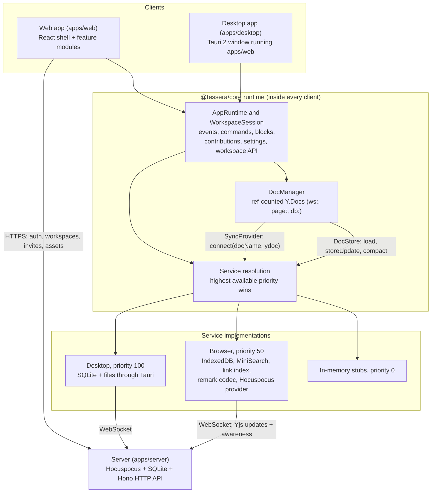

# Architecture

This page is a map of Tessera for contributors. The detailed contract, with every type, schema and
extension point, is [SPEC.md](https://github.com/femboypuppy/Tessera-Notes/blob/main/SPEC.md); the code
in `packages/core` is the source of truth.

## The big picture



## How an edit flows

1. The editor changes the page's `Y.Doc` (a [Yjs](https://github.com/yjs/yjs) document).
2. The `DocManager` sees the update and calls `DocStore.storeUpdate` right away, retrying on
   failure. The edit is now durable on the device.
3. The `SyncProvider` sends it to the server, which stores it and forwards it to other clients.
4. The runtime turns document changes into events (`doc.changed`, `page.*`), and the search and
   link indexes update from them.

Remote edits arrive the same way in reverse and fire the same events, with `local: false`.

## The repository

| Folder                          | What it is                                                                |
| ------------------------------- | ------------------------------------------------------------------------- |
| `packages/core`                 | The contract: data model helpers, document schema, service interfaces, in-memory stubs, the runtime, React bindings and test helpers. No DOM needed. |
| `packages/ui`                   | Design tokens, Radix-based components and `t()` for translations.         |
| `packages/editor`               | The TipTap block editor.                                                  |
| `packages/sync`                 | IndexedDB storage, the Hocuspocus sync provider, presence and history.    |
| `packages/db-views`             | The database query engine and views.                                      |
| `packages/search`               | Search index, command palette, backlinks and graph.                       |
| `packages/plugins`, `plugin-api`, `create-tessera-plugin` | The plugin host, the plugin SDK and the scaffolder. |
| `packages/markdown`, `importers` | The markdown codec, importers and exporters.                             |
| `packages/testkit`              | Seeded workspace generator and test helpers.                              |
| `apps/web`                      | The app shell. It loads every feature through `src/features/<area>/index.ts`. |
| `apps/server`                   | The sync and API server, which also serves the web app.                   |
| `apps/desktop`                  | The Tauri desktop app.                                                    |
| `e2e/`                          | Playwright tests, one folder per area.                                    |
| `docs/`                         | This site (VitePress).                                                    |

A feature package depends only on `core`, `ui` and its own libraries, never on another feature
package — with a couple of natural exceptions, like `importers` using `markdown` and `plugins`
using `plugin-api`. That keeps features independent and replaceable.

## Documents and data

Everything a user writes lives in Yjs documents, so it can sync and merge:

| Doc               | Name               | Holds                                                               |
| ----------------- | ------------------ | ------------------------------------------------------------------- |
| Workspace         | `ws:<workspaceId>` | Page metadata (title, icon, parent, order, trash), workspace settings. |
| Page              | `page:<pageId>`    | The page's content (a ProseMirror fragment) and its properties.     |
| Database          | `db:<databaseId>`  | Property definitions, views, and every row's values.                |

A few rules make this work:

- **Titles live in page metadata**, so the sidebar and search never load page contents.
- **Database rows are pages.** A row's values live in the database doc (so views never load row
  pages); its body is an ordinary page doc.
- **Trash is implicit** for descendants: trashing a page marks only that page, and restoring it
  brings back exactly what was trashed.
- **The tree is repaired deterministically** after concurrent moves, so every client shows the
  same tree.
- Other code never touches raw Yjs maps: typed helpers in `packages/core` validate input and run
  in one transaction.

## One document schema

`packages/core/src/schema` defines the canonical ProseMirror schema. The editor implements exactly
this schema (a test compares them), the markdown codec produces it, and the indexers read it.
Anything that isn't core text formatting is an `embed` block with a `kind`: `database`, `web`,
`file` or `plugin:<id>/<type>`.

## Services and priorities

Storage, sync, search, links and markdown are **services** with one interface and several
implementations. At startup, the runtime picks the highest-priority implementation that is
available: in-memory stubs (0), browser implementations (50) or desktop ones (100). That's how the
same app runs in a browser, in Tauri and in tests.

| Service             | Stub                   | Real implementations                    |
| ------------------- | ---------------------- | --------------------------------------- |
| `workspaceRegistry` | in memory              | IndexedDB, Tauri                        |
| `docStore`          | in memory              | IndexedDB, Tauri SQLite                 |
| `assetStore`        | object URLs            | IndexedDB, Tauri files                  |
| `syncProvider`      | local only             | Hocuspocus (when a server is set)       |
| `searchIndex`       | substring search       | MiniSearch in a worker                  |
| `linkIndex`         | naive                  | Graph link index                        |
| `markdownCodec`     | paragraphs and headings | unified/remark with Obsidian syntax    |

## Features plug in, they don't patch

Each feature exports one `FeatureModule` from `apps/web/src/features/<area>/index.ts`. It
registers what it adds: routes, commands, page bodies (the editor for pages, the database view for
databases), side panels, top-bar items, block renderers, settings panels, onboarding actions,
overlays, importers, exporters and services. The shell renders each contribution inside an error
boundary, so one broken feature never takes the app down.

```ts
export const backlinksFeature = defineFeature({
  id: 'backlinks',
  pageSidePanels: [
    { id: PANELS.backlinks, title: t('backlinks'), icon: Link2, component: BacklinksPanel },
  ],
});
```

Heavy code (TipTap, sigma.js, MiniSearch, remark) loads lazily, so the app starts with less than
250 KB of JavaScript.

## Performance budgets

| Budget                      | Target                                     |
| --------------------------- | ------------------------------------------ |
| Startup JavaScript          | ≤ 250 KB gzip                              |
| Cold start, 5,000 pages     | < 2 s to an interactive sidebar            |
| Typing on a 2,000-block page | < 16 ms p95                               |
| Search                      | < 50 ms p95 per query on 5,000 pages       |
| Filtering a database        | < 50 ms for 10,000 rows                    |

## Security

- Untrusted input (server configuration, HTTP requests, plugin messages, imported files, pasted
  HTML, data from other peers) is validated with zod.
- HTML from anywhere is sanitized with DOMPurify. No `eval`, no `new Function`.
- Plugins run in sandboxed iframes (`allow-scripts` without `allow-same-origin`) and talk to the
  app through a validated message protocol, with permissions checked on every call.
- The server enforces every permission; viewers get read-only connections.

To report a vulnerability, see the security policy in the repository.
