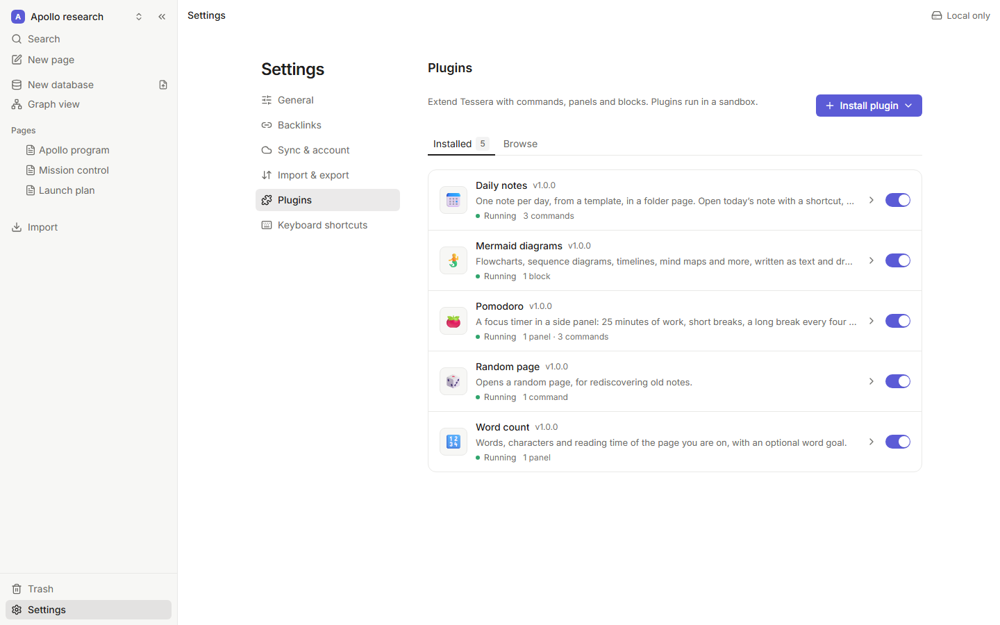
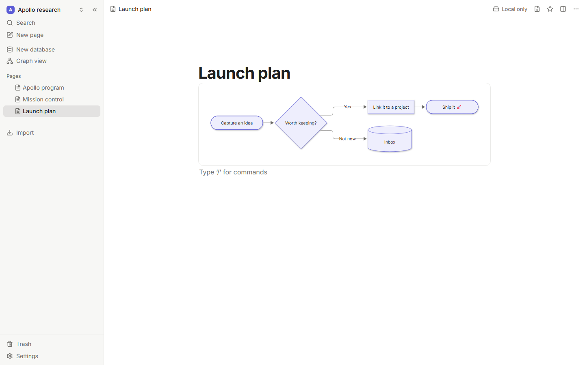
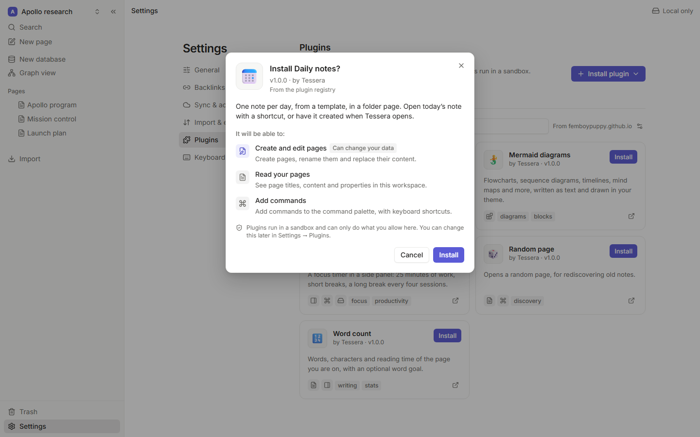

# Plugins

Plugins add commands, side panels and custom blocks to Tessera, and can read and write your pages
and databases when you allow it. They are small ES modules written against a typed SDK,
[`@tessera/plugin-api`](./api.md), and every one of them runs in a sandbox: a plugin can only do
what its permissions allow, and a broken plugin can't take the app down with it.



## For plugin authors

- **[Getting started](./getting-started.md)**: a working plugin with a command, a panel and a
  custom block in five minutes, with live reload and tests.
- **[API reference](./api.md)**: everything `api` can do, generated from the SDK's TSDoc.
- **[Permissions and security](./permissions.md)**: what each permission allows, how the sandbox
  works, and its limits.
- **[Publishing](./publishing.md)**: package your plugin and list it in a registry.

```ts
import { definePlugin } from '@tessera/plugin-api';

export default definePlugin({
  activate(api) {
    api.commands.register({
      id: 'say-hello',
      title: 'Say hello',
      run: () => api.ui.notify('Hello from my first plugin 👋'),
    });
  },
});
```

## What a plugin can do

| Capability | API | Permission |
| --- | --- | --- |
| Commands in the palette, with shortcuts | [`api.commands.register`](./api.md#api-commands-register) | `ui:commands` |
| Side panels next to the page | [`api.ui.addPanel`](./api.md#api-ui-addpanel) | `ui:panels` |
| Custom blocks, inserted from the slash menu, with data saved in the page | [`api.ui.addBlock`](./api.md#api-ui-addblock) | `ui:blocks` |
| Read pages as markdown or as a document tree, and follow changes | [`api.pages`](./api.md#pages) | `pages:read` |
| Create pages, rename them, replace their content | [`api.pages`](./api.md#pages) | `pages:write` |
| Query databases by property and option names | [`api.databases`](./api.md#databases) | `databases:read` |
| Add and update database rows | [`api.databases`](./api.md#databases) | `databases:write` |
| Private key-value storage on this device | [`api.storage`](./api.md#storage) | `storage` |
| `fetch` to a declared domain | the browser's `fetch` and `WebSocket` | `network:api.example.com` |
| Settings with a generated form | [`api.settings`](./api.md#settings) | none |
| The app's theme (colors, fonts, light or dark) | [`api.theme`](./api.md#theme) | none |
| Notifications | [`api.ui.notify`](./api.md#api-ui-notify) | none |

## Examples

The repository ships five complete plugins in
[`examples/plugins`](../../examples/plugins), each with a README and tests:

- **Word count** 🔢: a side panel that follows the open page as you type.
- **Daily notes** 📅: commands with shortcuts, pages created from a template, work at startup.
- **Pomodoro** 🍅: a timer panel whose state lives in storage, shared with the worker.
- **Random page** 🎲: the smallest useful plugin, one command.
- **Mermaid diagrams** 🧜: a custom block with a live editor, drawn in the app's theme.



## Installing plugins

Everything happens in **Settings → Plugins**:

- **Browse** lists the plugins of a registry (the example registry by default; the source can be
  changed next to the search box). Installing from it checks the download's checksum and that
  the plugin asks for nothing beyond what the registry lists.
- **Install plugin** installs from a `.zip` file, a plugin folder (where the browser supports
  picking folders), or a URL to a `.zip` or a `manifest.json`.
- **Load a dev plugin** connects to a plugin author's dev server and reloads the plugin each time
  its code changes.

Before anything is installed, Tessera shows what the plugin will be able to do, in plain words.
Each plugin's page in Settings has its permissions (each can be revoked at any time), its
settings, a console with its logs and errors, and Uninstall, which also deletes its stored data.


