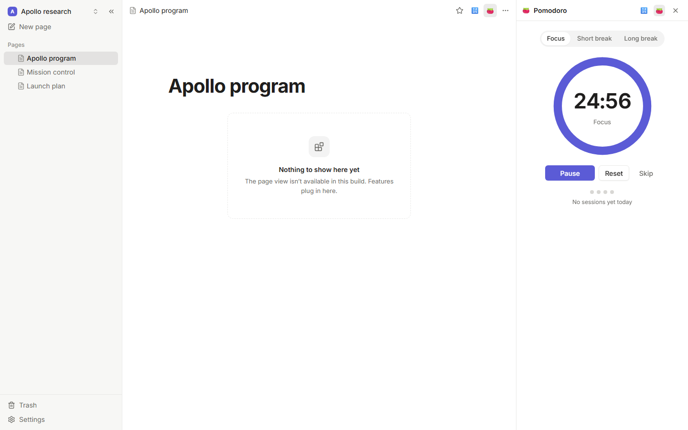

# Pomodoro

A focus timer in a side panel: 25 minutes of focus, a 5-minute break, and a 15-minute break
after every fourth session. Start, pause and skip from the panel, or with **Pomodoro: Start or
pause the timer** (`Mod+Alt+P`). When a session ends you get a notification, even if the panel is
closed.



## Permissions

| Permission | Why |
|---|---|
| `ui:panels` | To show the timer. |
| `ui:commands` | To add its commands. |
| `storage` | To keep the timer running across panels, reloads and restarts. |

It can't read or change your pages.

## Settings

Focus, short and long break lengths (minutes), how many sessions come before a long break, and
whether to notify you when a session ends.

## How it works

The timer is a small state machine (`src/timer.ts`) stored as JSON in `api.storage`. The panel
and the plugin's worker share it: the panel renders it and changes it; the worker listens with
`api.storage.onChange`, waits for the session to end, moves on to the next one and calls
`api.ui.notify`. That split is the pattern for any plugin whose panel shows state that must keep
going when the panel closes.

## Develop

```sh
pnpm install
pnpm test
pnpm build
```
